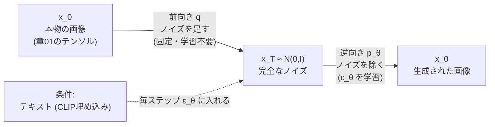

# 画像生成 — 拡散モデル（DDPM・latent diffusion）

:::abstract[学習目標]
この章を読み終えると、次のことができるようになります。

- 拡散モデルの **前向き過程**（画像に少しずつノイズを足す固定の過程）と **逆向き過程**（ノイズ除去を学ぶ過程）を**区別**して説明できる
- 任意ステップへ一発で飛べる **閉形式** $x_t=\sqrt{\bar\alpha_t}\,x_0+\sqrt{1-\bar\alpha_t}\,\epsilon$ を**導出**し、なぜ学習が高速になるかを述べられる
- ネットワークが学ぶのは画像でも平均でもなく **加えたノイズ $\epsilon$** であること、損失が $\lVert\epsilon-\epsilon_\theta(x_t,t)\rVert^2$ に簡約されることを**説明**できる
- **DDPM** の逆向きサンプリング・**latent diffusion (Stable Diffusion)** の潜在空間化・**text→image** の条件付け（CFG）を**列挙**できる
- 拡散（多ステップ・曲がった経路）と **flow matching**（直線・少ステップ、[音声章07](/audio/07-flow-matching-tts/)）が同じ「ノイズ→生成」族で、後者が経路を直線化した親戚であることを**対比**できる
- numpy だけの 1D/2D トイで前向きノイズ付加と逆向きサンプリングを動かし、**損失が下がること**と**ノイズから2クラスタが復元されること**を**実測**で確かめられる
:::

## 前提知識

- [視覚 章01 CNN](/vision/01-cnn/)：画像を `[高さ, 幅, チャネル]` のテンソルとして扱うこと、畳み込みが**局所パターン**を拾うこと。拡散モデルのノイズ除去ネット（U-Net）は畳み込みで作られます
- [音声 章07 連続生成 TTS（flow matching）](/audio/07-flow-matching-tts/)：**ノイズ→データを連続な流れで運ぶ**という発想と、diffusion が「曲がった多ステップの経路」だという対比。**この章は同じ族の画像版**であり、章07と数理を共有します
- 確率の基礎：ガウス分布 $\mathcal N(\mu,\sigma^2)$、期待値 $\mathbb E[\cdot]$、サンプリング、独立な正規変数の和
- 微積分の基礎：連鎖（チェーン）的な合成、二乗の展開

LLM 出身の読者へ。LLM は「離散トークンを1つずつ自己回帰で生成」しました。拡散は**生成のパラダイムが違います**。「ノイズだらけの画像を、少しずつ拭っていって絵にする」反復です。系列方向ではなく、**ノイズ→データの時間方向 $t$** に反復します。すでに [音声章07](/audio/07-flow-matching-tts/) を読んでいれば、そこで脇に置いた「image diffusion」の中身を、ここで開けることになります。

## 直感

私たちが解きたいのは、**ランダムなノイズから、本物そっくりの画像を作る**ことです。素朴には「ノイズ → 画像」を1発で当てたい。ですが画像の分布はあまりに複雑で（猫の画像が満たすべき条件を1つの式で書けますか？）、1発回帰は破綻します。

拡散モデルの発想は、この難問を **小さな問題の積み重ね**に分解することです。鍵は、**逆の操作なら簡単**だという観察です。きれいな画像に少量のノイズを足すのは一瞬でできます。これを何百回も繰り返せば、画像は完全なノイズに溶けます。これが **前向き過程（forward process）** —— 学習も推論も不要、ただノイズを足すだけの**固定された壊し方**です。

ならば、その**各ステップを逆再生**できれば、ノイズから画像へ戻れるはずです。「少しノイズが乗った画像」から「そのノイズを少し除いた画像」を作る —— この**1ステップのノイズ除去だけ**をニューラルネットに学ばせます。1発で猫を描くのは無理でも、「ほんの少しだけきれいにする」なら学べる。あとはそれを何百回も繰り返せば、ノイズが画像になります。

これが拡散モデルです。**壊し方は固定（前向き）、直し方を学ぶ（逆向き）**。生成は「ノイズから始めて、学んだ直し方を反復適用する」だけ。本章は視覚ロードマップの **画像生成** の骨格にあたり、現代の text→image（Stable Diffusion・DALL-E・Midjourney）すべての土台です。

## 全体像

拡散の往復を1枚で見ます。**上向きの矢印が前向き（壊す・固定）、下向きが逆向き（直す・学習）** です。ここを最初に掴むのが肝心です。



学習時と推論時で **入力も向きも反転** します。この表を頭に入れてください。

| | 学習時（training） | 推論時（inference / 生成） |
| --- | --- | --- |
| 入力 | 本物の画像 $x_0$ と、ランダムな $t$・ノイズ $\epsilon$ | **ノイズ $x_T$ だけ** |
| 何をする | 1ステップで足したノイズ $\epsilon$ を**当てる回帰** | $t=T\to0$ へ**逆向きに反復**してノイズを除く |
| 向き | 前向き（一発で $x_t$ を作って学習） | 逆向き（$x_T\to x_{T-1}\to\dots\to x_0$） |
| $x_0$ は | **既知**（教師信号の素） | **未知**（これを生成する） |
| 反復回数 | 1回（1サンプルにつき1つの $t$ をサンプル） | 多数（$T$ ステップ、DDPM で数十〜千） |

:::warning[ネットワークは画像を出力しません]
最大の誤解です。ノイズ除去ネット $\epsilon_\theta$ が出すのは **きれいな画像そのものではなく、「いまの $x_t$ に乗っている**ノイズ $\epsilon$**」の推定値**です。画像 $x_0$ は、そのノイズ推定を使って **1ステップずつ逆向きに引き算した結果**として、$T$ ステップ後に初めて現れます。「ネットが絵を吐く」ではなく「ネットがノイズを言い当て、引き算の反復が絵を作る」。この一文を取り違えると全部ずれます。（後で見るように、ノイズ予測と画像予測・平均予測は数学的に等価で相互変換できますが、DDPM が実際に回帰するのは $\epsilon$ です。）
:::

:::note[LLM ↔ 拡散]
LLM の自己回帰は「離散トークンを系列方向に1つずつ」。拡散は「連続な画像テンソルを、ノイズ→データの**時間方向 $t$** に少しずつ」。共通点は「条件（テキスト）を**毎ステップ**見ながら反復する」こと。違いは、動かす対象が**離散トークン**か**連続なテンソル**か、反復が**系列方向**か**$t$ 方向**か、です。
:::

解く順番はこうです。まず前向き過程（壊し方）を定義し、その**閉形式**（任意ステップへ一発で飛ぶ式）を作ります。次に逆向き過程（直し方）を定義し、**学習目的がノイズ予測の二乗誤差に簡約される**ことを導きます。最後に DDPM の生成手順・潜在拡散・条件付けへ進み、flow matching との関係を結びます。

## 理論

### 前向き過程：固定された「壊し方」

前向き過程は、本物の画像 $x_0$ に、$T$ ステップかけて少しずつガウスノイズを足していく **マルコフ連鎖** です。1ステップは次で定義します。

$$
q(x_t\mid x_{t-1})=\mathcal N\!\left(x_t;\ \sqrt{1-\beta_t}\,x_{t-1},\ \beta_t I\right)
$$

記号を全部定義します。

- $x_t$：時刻 $t$ の画像（$t=0,1,\dots,T$）。$x_0$ と**同じ形**のテンソル（章01の `[高さ, 幅, チャネル]`、トイでは 2 次元ベクトル）。$x_0$ が本物、$x_T$ がほぼ純ノイズ。
- $\beta_t\in(0,1)$：時刻 $t$ の **ノイズスケジュール**。「このステップでどれだけノイズを足すか」を決める**固定の定数列**（例：$\beta_1=10^{-4}$ から $\beta_T=0.02$ へ線形に増やす）。データに依存せず、学習もしません。
- $\sqrt{1-\beta_t}$：直前の画像を**少し縮める**係数（1 より小さい）。
- $\beta_t I$：足すガウスノイズの**分散**（$I$ は単位行列＝各成分独立・等分散）。

この1ステップが何をしているか、言葉で。「直前の画像 $x_{t-1}$ を $\sqrt{1-\beta_t}$ 倍にちょっと縮め、そこへ分散 $\beta_t$ の新しいノイズを足す」。縮めるのは、ノイズを足し続けても**全体の大きさ（分散）が発散しないように**するためです。実際、$x_{t-1}$ の分散が 1 なら、$x_t$ の分散は $(1-\beta_t)\cdot 1+\beta_t=1$ で**保たれます**（variance preserving）。

:::note[なぜ縮めてから足すのか]
ただノイズを足すだけ（$x_t=x_{t-1}+\epsilon$）だと、分散がステップごとに増えて青天井になり、$x_T$ がどんな大きさか予測できません。$\sqrt{1-\beta_t}$ で縮めることで、**$T$ が大きいとき $x_T$ がきれいに $\mathcal N(0,I)$ に収束**します。生成はこの $\mathcal N(0,I)$ から始めるので、「出発点が決まった分布」であることが本質的に効きます。
:::

### 閉形式：任意ステップへ一発で飛ぶ

前向きを $t$ 回繰り返さなくても、$x_0$ から **任意の $x_t$ へ一発でジャンプ**できます。ここが拡散の学習を高速にする急所です。$\alpha_t:=1-\beta_t$、$\bar\alpha_t:=\prod_{s=1}^{t}\alpha_s$ とおくと、

$$
x_t=\sqrt{\bar\alpha_t}\,x_0+\sqrt{1-\bar\alpha_t}\,\epsilon,\qquad \epsilon\sim\mathcal N(0,I)
$$

記号を定義します。

- $\alpha_t=1-\beta_t$：1ステップで「残る信号の割合」。
- $\bar\alpha_t=\alpha_1\alpha_2\cdots\alpha_t$：時刻 $t$ までの**累積**。$t$ が進むほど 1 から 0 へ単調に減ります。
- $\sqrt{\bar\alpha_t}$：$x_0$ がどれだけ**残っているか**の係数。$t$ が小さければ ≈1（画像が見える）、大きければ ≈0（画像が消える）。
- $\sqrt{1-\bar\alpha_t}$：**ノイズがどれだけ乗っているか**の係数。$t$ とともに 0 から 1 へ。
- $\epsilon$：その $x_t$ を作るのに使った**1つのガウスノイズ**。これが後で**学習の正解ラベル**になります。

この式の意味は、「$x_t$ は、本物 $x_0$ をスケール $\sqrt{\bar\alpha_t}$ で薄めたものに、スケール $\sqrt{1-\bar\alpha_t}$ のノイズを混ぜたもの」。$t$ を 1 つランダムに選べば、$x_0$ から**1回の計算で**訓練サンプル $x_t$ が作れる —— だから何百ステップの連鎖を回さずに学習できます。（導出は後述の「数式の導出」で。）

:::warning[2 種類の $t$ を混同しない]
拡散には紛らわしい「$t$」が出ます。**(a) 拡散ステップ $t$**（$0\to T$、ノイズの量を表す。本章の主役）と、**(b)** flow matching での **連続時間 $t\in[0,1]$**（[音声章07](/audio/07-flow-matching-tts/)）。向きも逆です：本章の前向きは $t$ が増えるほど**ノイズが増える**のに対し、章07 の $t$ は増えるほど**データに近づく**。後で両者を対応づけますが、いま読む式の $t$ がどちらの意味かを毎回確認してください。
:::

### 逆向き過程：学ぶべき「直し方」

生成は前向きの逆、$x_T\sim\mathcal N(0,I)$ から $x_0$ へ戻る道です。各ステップは「$x_t$ から $x_{t-1}$ を作る」操作で、これを学習可能なガウスでモデル化します。

$$
p_\theta(x_{t-1}\mid x_t)=\mathcal N\!\left(x_{t-1};\ \mu_\theta(x_t,t),\ \Sigma_t\right)
$$

- $\mu_\theta(x_t,t)$：逆向き1ステップの**平均**。ネットワーク（パラメータ $\theta$）が出します。**「$x_t$ から少しノイズを除いたらどこにいるか」**。
- $\Sigma_t$：逆向きの**分散**。DDPM では学習せず $\sigma_t^2 I$（$\sigma_t^2=\beta_t$ など）に固定するのが簡単で、それで十分動きます。
- $\theta$ に依存するのは平均だけ。だから**ネットが学ぶのは「どこへ戻すか」**です。

ここで決定的な事実があります。**前向きが各ステップで足したノイズ量が小さい（$\beta_t$ が小さい）とき、逆向きの真の分布もガウスで近似できる**。だから逆向きをガウスでモデル化するのは妥当です。問題は平均 $\mu_\theta$ をどう学ぶか。次節で、**それがノイズ予測に化ける**ことを見ます。

### 学習目的：なぜ「ノイズ予測」になるのか

逆向きの平均 $\mu_\theta$ を直接当てる代わりに、DDPM は **「その $x_t$ を作るのに使われたノイズ $\epsilon$」を当てる**ネット $\epsilon_\theta(x_t,t)$ を学習します。閉形式 $x_t=\sqrt{\bar\alpha_t}\,x_0+\sqrt{1-\bar\alpha_t}\,\epsilon$ を $x_0$ について解くと

$$
x_0=\frac{1}{\sqrt{\bar\alpha_t}}\left(x_t-\sqrt{1-\bar\alpha_t}\,\epsilon\right)
$$

なので、$\epsilon$ さえ当たれば $x_0$ が復元でき、そこから逆向きの平均 $\mu_\theta$ も決まります。つまり **「ノイズを当てる」=「どこへ戻すかを当てる」** が等価なのです。変分下界（ELBO）を丁寧に整理すると、各 $t$ の項が次の素朴な二乗誤差に簡約されます（重み係数を 1 に揃えた **simplified loss**）。

$$
L_\text{simple}=\mathbb E_{x_0,\ \epsilon,\ t}\left[\ \bigl\lVert \epsilon-\epsilon_\theta(x_t,\,t)\bigr\rVert^2\ \right],\qquad x_t=\sqrt{\bar\alpha_t}\,x_0+\sqrt{1-\bar\alpha_t}\,\epsilon
$$

これだけです。**「本物画像 $x_0$ を引き、ランダムな $t$ とノイズ $\epsilon$ を引き、$x_t$ を一発で作り、$\epsilon_\theta$ にその $\epsilon$ を当てさせる」**。回帰問題そのものになりました。

- **記号**：$\epsilon$ が正解（真に足したノイズ）、$\epsilon_\theta(x_t,t)$ がネットの推定。両者の差の二乗が損失。$t$ もミニバッチごとに一様にサンプルします（全ノイズレベルを満遍なく学ぶため）。
- **なぜ簡単になるか**：1ステップの $\mu_\theta$ を当てる難問が、「混ぜたノイズを言い当てる」という**素直な教師あり回帰**に化けます。教師信号 $\epsilon$ は自分で引いたので**完全に既知**。ラベル付けもアライメントも要りません。
- **学習時 vs 推論時**：学習は閉形式で $x_t$ を一発生成して回帰するだけ（連鎖を回さない）。推論は逆向きの連鎖を $T$ 回回す（後述）。**ここが計算の非対称性**で、学習は速いが生成は多ステップ、という拡散の性格を決めます。

:::note[LLM ↔ 拡散の損失]
LLM の事前学習損失は「次トークンの cross-entropy（分類）」でした。拡散は「足したノイズの二乗誤差（回帰）」。どちらも **self-supervised**（正解を自前で作る）点は同じです。LLM はテキストを右にずらして正解を作り、拡散はノイズを引いて正解にします。「答えを人手で付けない」枠組みである点で同根です。
:::

### DDPM の生成：逆向きを反復する

学習した $\epsilon_\theta$ で、ノイズから画像を作ります。$x_T\sim\mathcal N(0,I)$ から始め、$t=T,T-1,\dots,1$ と**逆向きに**1ステップずつ進みます。各ステップ：

$$
x_{t-1}=\frac{1}{\sqrt{\alpha_t}}\left(x_t-\frac{\beta_t}{\sqrt{1-\bar\alpha_t}}\,\epsilon_\theta(x_t,t)\right)+\sigma_t\,z,\qquad z\sim\mathcal N(0,I)
$$

- 第1項（平均 $\mu_\theta$）：「いまの $x_t$ から、推定ノイズ $\epsilon_\theta$ のぶんを引き、$1/\sqrt{\alpha_t}$ でスケールを戻す」。これが**1ステップぶんのノイズ除去**です。
- 第2項 $\sigma_t z$：**新しいランダムノイズを少し足し戻す**。これがないと毎回同じ絵しか出ません。多様なサンプルを得るための「ゆらぎ」。最後のステップ（$t=1\to0$）だけは足しません（確定させる）。
- これを $T$ 回繰り返すと $x_0$（生成画像）が現れます。$T$ ステップ＝**ネット評価 $T$ 回**で、これが「拡散は多ステップで遅い」の正体です。

:::note[サンプラの選択（DDPM vs DDIM）]
上は確率的な DDPM サンプラです。**DDIM** は第2項のノイズを 0 にして**決定的**にし、かつステップを間引いて（例 1000→50）速く生成します。さらに後述の通り、**flow matching の直線経路にすると数ステップで十分**になります。サンプラはモデルを変えずに差し替えられる「推論時の選択肢」です。
:::

### latent diffusion：潜在空間で拡散する（Stable Diffusion）

ピクセル空間（例 $512\times512\times3$ ≈ 78 万次元）で拡散を回すのは重すぎます。各生成で U-Net を数十回、高解像度テンソルに対して評価するからです。**Latent Diffusion Model (LDM) / Stable Diffusion** の発想は単純です。

1. **VAE（オートエンコーダ）で画像を低次元の潜在 $z$ に圧縮**する（例 $512\times512\times3 \to 64\times64\times4$、約 48 倍の圧縮）。エンコーダ $E$ が $z=E(x)$、デコーダ $D$ が $x\approx D(z)$。
2. **拡散を $z$ の空間で回す**。前向き・逆向き・ノイズ予測、すべて潜在 $z$ に対して行います。式はこれまでと同一で、$x$ を $z$ に置き換えるだけ。
3. **生成後、デコーダで画像へ戻す**：$z_0 \to x = D(z_0)$。

これで計算量が桁で下がり、高解像度生成が一般の GPU で回せるようになりました。**Stable Diffusion がオープンに公開され、text→image が一気に普及した**のはこの潜在化のおかげです。

:::note[なぜ VAE 潜在で「細部が落ちない」のか]
VAE は知覚的に重要な構造を保ちつつ、冗長なピクセルの高周波だけを圧縮します。拡散は**意味のある潜在の上**で「どの構造を組むか」に集中でき、最後のピクセル復元は決定的なデコーダ $D$ に任せる。役割分担（拡散＝構造の生成 / VAE＝ピクセル復元）が効率と品質を両立させます。
:::

### 条件付け：text→image（CFG）

ここまでは「何でもいいから本物っぽい画像」を作る無条件生成でした。**text→image** は、ノイズ予測ネットに**テキスト条件 $c$** を追加で食わせるだけです：$\epsilon_\theta(x_t,t,c)$。

- $c$ = テキストを **CLIP** などのエンコーダで埋め込んだベクトル（[視覚分野の表現学習](/vision/)で扱う画像-テキスト整列）。U-Net の各層に **cross-attention** で注入します（"a cat" というプロンプトが、生成途中の特徴のどこに効くかを attention が決める）。
- 学習は無条件とほぼ同じ。損失は $\lVert\epsilon-\epsilon_\theta(x_t,t,c)\rVert^2$ で、画像とそのキャプションのペアで回します。

ただ条件を入れるだけだと「プロンプト追従が弱い」。そこで **Classifier-Free Guidance (CFG)** を使います。学習時に条件 $c$ をときどき空 $\varnothing$ に落とし、**条件あり/なしの両方**を1つのネットに覚えさせる。推論時に両者を外挿します。

$$
\hat\epsilon=\epsilon_\theta(x_t,t,\varnothing)+w\,\bigl(\epsilon_\theta(x_t,t,c)-\epsilon_\theta(x_t,t,\varnothing)\bigr)
$$

- $\epsilon_\theta(x_t,t,c)-\epsilon_\theta(x_t,t,\varnothing)$：「条件があることで予測がどちらへ動くか」の方向。
- $w$（guidance scale、例 7.5）：その方向を**何倍に強調するか**。大きいほどプロンプト忠実だが、多様性が落ち不自然になりやすい（トレードオフ）。
- 代償：毎ステップ条件あり/なしの**2回**ネットを評価する（生成コスト2倍）。

:::note[LLM ↔ CFG]
LLM の温度・top-p が「出力の尖り具合」を推論時に回すつまみだったように、CFG は「条件への効き具合」を回すつまみです。$w$ を上げるほど決定的・忠実に、下げるほど多様に。**音声章07の flow matching でも同じ CFG** が使われます（$\tilde v=(1+w)v_\theta(\cdot,c)-w\,v_\theta(\cdot,\varnothing)$）。族が同じなので、つまみも共通です。
:::

### flow matching との関係：曲がった道とまっすぐな道

[音声章07](/audio/07-flow-matching-tts/) で flow matching を学んだ読者へ。拡散と flow matching は**同じ「ノイズ→生成」族**です。違いは一言、**ノイズからデータへ運ぶ道がまっすぐか曲がっているか**。

- **拡散**：経路を「ノイズを徐々に足す/除く拡散過程」で定義するため、ノイズ→データの軌道が**曲がります**。曲がった道を直線近似（Euler）でショートカットすると外れるので、**多ステップ（数十〜千）**刻む必要がある。
- **flow matching（OT 直線経路）**：ノイズ $x_0$ とデータ $x_1$ を**まっすぐ線形補間** $x_t=(1-t)x_0+t x_1$ する。目標速度が定数 $x_1-x_0$ になり、Euler の離散化誤差がほぼゼロ。だから**少ステップ（数〜十数）**で着く。

| | 拡散（diffusion） | flow matching（OT 経路、章07） |
| --- | --- | --- |
| 経路の定義 | 拡散過程（ノイズ付加/除去） | ノイズ→データの**直線補間** |
| 軌道の形 | **曲がっている** | **まっすぐ** |
| ネットが学ぶ | **ノイズ** $\epsilon$（or スコア） | **速度** $x_1-x_0$ |
| 損失 | $\lVert\epsilon-\epsilon_\theta(x_t,t)\rVert^2$ | $\lVert v_\theta(x_t,t)-(x_1-x_0)\rVert^2$ |
| 必要ステップ | 多い（数十〜千） | **少ない**（数〜十数） |
| 代表 | DDPM, Stable Diffusion 1/2 | SD3, FLUX（章07の F5-TTS と同系） |

両者は**スコア（対数尤度の勾配）と速度**を介して数学的に橋渡しでき、ノイズ予測 $\epsilon_\theta$ とスコア $s_\theta$ は $s_\theta(x_t,t)=-\epsilon_\theta(x_t,t)/\sqrt{1-\bar\alpha_t}$ の関係にあります。だから「拡散を一般化したのが flow matching」と捉えるのが正確です（章07の通り、flow matching は diffusion を特殊ケースとして**含む**より広い枠組み）。

:::warning[拡散＝多ステップ、flow matching＝少ステップ（混同注意）]
ここを取り違える人が多い。**拡散は経路が曲がっているので原理的に多ステップ**が要ります（だから DDPM は数百〜千ステップ、DDIM で間引いても数十）。**flow matching は経路をまっすぐにしたので少ステップ**で済みます（章07の F5-TTS は約7ステップ）。「拡散は遅い、flow matching は速い」の差は実装の良し悪しではなく、**運ぶ道の曲がり方という構造の違い**から来ます。なお Consistency Models / LCM のように、拡散を蒸留して 1〜4 ステップに圧縮する別系統の高速化もありますが、これは「経路を直すのでなく、多ステップの結果を1ステップに教え込む」アプローチで、原理が異なります。詳細は章07を参照。
:::

## 数式の導出

前向きの**閉形式** $x_t=\sqrt{\bar\alpha_t}\,x_0+\sqrt{1-\bar\alpha_t}\,\epsilon$ を、1ステップ定義から導きます。これが「任意 $t$ へ一発で飛べる」根拠であり、学習を高速にする心臓です。

**ステップ1：1ステップを再パラメータ化する。** 1ステップ定義 $q(x_t\mid x_{t-1})=\mathcal N(\sqrt{1-\beta_t}\,x_{t-1},\beta_t I)$ は、独立な $\epsilon_{t}\sim\mathcal N(0,I)$ を使って次と同値です（reparameterization）。$\alpha_t=1-\beta_t$ とおくと、

$$
x_t=\sqrt{\alpha_t}\,x_{t-1}+\sqrt{1-\alpha_t}\,\epsilon_t
$$

**ステップ2：2ステップ分を合成する。** これを $x_{t-1}=\sqrt{\alpha_{t-1}}\,x_{t-2}+\sqrt{1-\alpha_{t-1}}\,\epsilon_{t-1}$ で展開します。

$$
x_t=\sqrt{\alpha_t}\left(\sqrt{\alpha_{t-1}}\,x_{t-2}+\sqrt{1-\alpha_{t-1}}\,\epsilon_{t-1}\right)+\sqrt{1-\alpha_t}\,\epsilon_t
$$

整理すると、$x_{t-2}$ の係数は $\sqrt{\alpha_t\alpha_{t-1}}$、ノイズ項は2つの独立ガウスの和になります。

$$
x_t=\sqrt{\alpha_t\alpha_{t-1}}\,x_{t-2}+\underbrace{\sqrt{\alpha_t(1-\alpha_{t-1})}\,\epsilon_{t-1}+\sqrt{1-\alpha_t}\,\epsilon_t}_{\text{独立ガウスの和}}
$$

**ステップ3：独立ガウスの和を1つにまとめる。** 平均 0・分散 $\sigma_a^2$ と $\sigma_b^2$ の独立ガウスの和は、平均 0・分散 $\sigma_a^2+\sigma_b^2$ の1つのガウスです。ここでの分散は

$$
\alpha_t(1-\alpha_{t-1})+(1-\alpha_t)=1-\alpha_t\alpha_{t-1}
$$

なので、新しい1つのノイズ $\bar\epsilon\sim\mathcal N(0,I)$ を使って

$$
x_t=\sqrt{\alpha_t\alpha_{t-1}}\,x_{t-2}+\sqrt{1-\alpha_t\alpha_{t-1}}\,\bar\epsilon
$$

**ステップ4：$x_0$ まで帰納する。** ステップ2–3を $x_0$ まで繰り返すと、係数は累積積 $\bar\alpha_t=\prod_{s=1}^{t}\alpha_s$ になり、ノイズ項の分散は $1-\bar\alpha_t$ にまとまります。よって、ただ1つのノイズ $\epsilon\sim\mathcal N(0,I)$ で

$$
x_t=\sqrt{\bar\alpha_t}\,x_0+\sqrt{1-\bar\alpha_t}\,\epsilon
\qquad\blacksquare
$$

この式があるおかげで、学習では $t$ を1つ引いて $x_t$ を**1回の計算**で作れます。次に、この $x_t$ に対する**最適な逆向きの平均**がノイズ予測で書けることを示します。

**ステップ5：逆向きの平均をノイズで表す。** ベイズで $q(x_{t-1}\mid x_t,x_0)$ を計算すると、これはガウスで、その平均は（係数の整理は省くと）

$$
\tilde\mu_t(x_t,x_0)=\frac{1}{\sqrt{\alpha_t}}\left(x_t-\frac{\beta_t}{\sqrt{1-\bar\alpha_t}}\,\epsilon\right)
$$

の形になります。ここで $x_0$ を閉形式 $x_0=(x_t-\sqrt{1-\bar\alpha_t}\,\epsilon)/\sqrt{\bar\alpha_t}$ で消すと、平均が **$\epsilon$ だけの関数**になることが鍵です。逆向きネットの平均 $\mu_\theta$ を、この形に $\epsilon$ の代わりに $\epsilon_\theta$ を入れた

$$
\mu_\theta(x_t,t)=\frac{1}{\sqrt{\alpha_t}}\left(x_t-\frac{\beta_t}{\sqrt{1-\bar\alpha_t}}\,\epsilon_\theta(x_t,t)\right)
$$

と設計すれば、平均の二乗誤差 $\lVert\tilde\mu_t-\mu_\theta\rVert^2$ は **$\lVert\epsilon-\epsilon_\theta\rVert^2$ に係数倍で一致**します。係数を 1 に丸めたのが $L_\text{simple}$ です。

$$
L_\text{simple}=\mathbb E_{x_0,\epsilon,t}\left[\lVert\epsilon-\epsilon_\theta(x_t,t)\rVert^2\right]
\qquad\blacksquare
$$

「逆向きの平均を当てる」が「混ぜたノイズを当てる」に化けた —— これが DDPM を実装可能にした簡約です。

## 実装

numpy だけで、**前向きでノイズを足し**、**ノイズ予測 $\epsilon_\theta$ を学習**し、**逆向きでサンプリング**する最小トイを作ります。深層ネットの代わりに、$\epsilon_\theta$ を **random Fourier features 上の ridge 回帰**（非線形だが numpy で閉じる）で実装します。U-Net の概念スケルトンと思ってください。本質（前向き閉形式・ノイズ予測損失・DDPM 逆向き反復）はそのまま現れます。

パート A で前向き過程が「データをノイズへ溶かす」ことを 1 次元で観察し、パート B で 2 クラスタのデータを学習して「ノイズから 2 クラスタが復元される」ことを確かめます。

```python title="diffusion_toy.py"
import numpy as np
rng = np.random.default_rng(0)

# ===== パート A: 前向き過程を1次元で観察 =====
T = 200
beta = np.linspace(1e-4, 0.04, T)        # 線形ノイズスケジュール beta_t
alpha = 1.0 - beta                        # alpha_t = 1 - beta_t
abar = np.cumprod(alpha)                  # alpha_bar_t = prod_{s<=t} alpha_s

x0 = rng.choice([-3.0, 3.0], size=40000)[:, None]   # +3 / -3 の二値データ
print("=== 前向き過程: x_t = sqrt(abar_t) x0 + sqrt(1-abar_t) eps ===")
for t in [0, 50, 100, 199]:
    eps = rng.standard_normal((40000, 1))
    # 閉形式で一発生成（連鎖を回さない）
    x_t = np.sqrt(abar[t]) * x0 + np.sqrt(1 - abar[t]) * eps
    print(f"t={t:3d}: sqrt(abar)={np.sqrt(abar[t]):.3f}  "
          f"平均={x_t.mean():+.2f}  分散={x_t.var():.2f}")
print()

# ===== パート B: 2D 拡散を学習 → 逆向きで生成 =====
def sample_data(n):
    # データ分布 = 2クラスタ（(+2,+2) と (-2,-2)）
    centers = np.array([[2.0, 2.0], [-2.0, -2.0]])
    idx = rng.integers(0, 2, size=n)
    return centers[idx] + 0.25 * rng.standard_normal((n, 2))

Td = 100
betad = np.linspace(1e-4, 0.04, Td)
alphad = 1.0 - betad
abard = np.cumprod(alphad)

# eps_theta(x_t, t) を random Fourier features 上の ridge 回帰で作る（非線形・numpy のみ）
# = 深層ノイズ除去ネット(U-Net)の概念スケルトン
D = 400
Omega = 0.8 * rng.standard_normal((3, D))   # 入力 = [x_t(2次元), t(1次元)]
bias = 2 * np.pi * rng.random(D)
def feat(x_t, t_idx):
    tn = (t_idx / (Td - 1))[:, None]        # t を [0,1] に正規化
    return np.cos(np.concatenate([x_t, tn], axis=1) @ Omega + bias)

# 学習サンプル: x0 と t と eps を引き、閉形式で x_t を作る
N = 60000
x0 = sample_data(N)
t_idx = rng.integers(0, Td, size=N)
eps = rng.standard_normal((N, 2))
x_t = np.sqrt(abard[t_idx])[:, None] * x0 + np.sqrt(1 - abard[t_idx])[:, None] * eps
Phi = feat(x_t, t_idx)
# ridge 回帰: ||eps - Phi W||^2 + lam||W||^2 を最小化（線形最小二乗の正則化版）
W = np.linalg.solve(Phi.T @ Phi + 1.0 * np.eye(D), Phi.T @ eps)

def loss(Wmat):
    return np.mean(np.sum((eps - Phi @ Wmat)**2, axis=1))
print("=== 学習: ノイズ予測の二乗誤差 ||eps - eps_theta||^2 ===")
print(f"loss (W=0, 予測なし) = {loss(np.zeros_like(W)):.4f}")
print(f"loss (学習後)        = {loss(W):.4f}")
print()

def eps_theta(x, t):
    return feat(x, np.full(x.shape[0], t)) @ W

def sample(n):
    x = rng.standard_normal((n, 2))                # x_T ~ N(0,I) から開始
    for t in range(Td - 1, -1, -1):                # 逆向きに反復
        e = eps_theta(x, t)
        # DDPM の平均: 1/sqrt(alpha_t) (x_t - beta_t/sqrt(1-abar_t) eps_theta)
        mean = (x - betad[t] / np.sqrt(1 - abard[t]) * e) / np.sqrt(alphad[t])
        # 最後(t=0)以外はゆらぎを足し戻す
        x = mean + (np.sqrt(betad[t]) * rng.standard_normal((n, 2)) if t > 0 else 0.0)
    return x

gen = sample(4000)
centers = np.array([[2.0, 2.0], [-2.0, -2.0]])
d = np.linalg.norm(gen[:, None, :] - centers[None], axis=2)
a = d.argmin(1)                                    # 各生成点を最近傍クラスタへ割当
print("=== 逆向きサンプリング（DDPM）: ノイズ → 2クラスタ ===")
print(f"生成平均(クラスタ0) = {gen[a==0].mean(0).round(2)}  (真値 [2,2])")
print(f"生成平均(クラスタ1) = {gen[a==1].mean(0).round(2)}  (真値 [-2,-2])")
print(f"いずれかのクラスタ近傍(<1.0)の割合 = {(d.min(1) < 1.0).mean():.2f}")
```

```text title="出力（uv run --with numpy python diffusion_toy.py）"
=== 前向き過程: x_t = sqrt(abar_t) x0 + sqrt(1-abar_t) eps ===
t=  0: sqrt(abar)=1.000  平均=-0.00  分散=9.00
t= 50: sqrt(abar)=0.877  平均=-0.01  分散=7.15
t=100: sqrt(abar)=0.598  平均=-0.00  分散=3.87
t=199: sqrt(abar)=0.131  平均=+0.00  分散=1.15

=== 学習: ノイズ予測の二乗誤差 ||eps - eps_theta||^2 ===
loss (W=0, 予測なし) = 2.0067
loss (学習後)        = 0.6134

=== 逆向きサンプリング（DDPM）: ノイズ → 2クラスタ ===
生成平均(クラスタ0) = [1.98 1.98]  (真値 [2,2])
生成平均(クラスタ1) = [-1.98 -1.98]  (真値 [-2,-2])
いずれかのクラスタ近傍(<1.0)の割合 = 1.00
```

読み取れること。

- **前向き（パート A）**：$x_0$ は $\pm3$ の二値で分散 9。$t$ が進むと $\sqrt{\bar\alpha_t}$ が 1→0.131 へ縮み、分散が 9→1.15 へ落ちる。$t=199$ では**ほぼ $\mathcal N(0,I)$**（分散 ≈1）。データがノイズに溶けました。平均が常に ≈0 なのは $\pm3$ が対称だから。
- **学習（パート B）**：ノイズ予測損失が **2.01 → 0.61** に下がる。$W=0$（予測なし）は「いつも 0 と答える」基準で、損失 ≈ ノイズ分散 2.0。学習で**乗っているノイズの向きを当てられる**ようになりました。
- **逆向き（パート B）**：純ノイズ $x_T$ から DDPM 反復で生成したサンプルが、**真の 2 クラスタ $\pm[2,2]$ をほぼ正確に復元**（平均 $\pm[1.98,1.98]$）。100% がいずれかのクラスタ近傍に落ちました。**ノイズから、学んだ「直し方」だけで、元のデータ分布が再現された**わけです。

これが拡散の全部です。実画像では、データが 2 クラスタでなく自然画像分布になり、$\epsilon_\theta$ が ridge 回帰でなく U-Net（章01の畳み込み）になり、$t$ への依存が時刻埋め込みになるだけ。**骨格（前向き閉形式・ノイズ予測損失・DDPM 逆向き反復）はこのトイのまま**です。

## 演習

::::question[演習 1: 前向き閉形式と「データが消える」感覚]
ノイズスケジュールが $\bar\alpha_t$ で与えられ、ある時刻で $\bar\alpha_t=0.04$ だとします。本物の画像 $x_0$（各成分の分散 1 とする）に対して、(a) 閉形式 $x_t=\sqrt{\bar\alpha_t}\,x_0+\sqrt{1-\bar\alpha_t}\,\epsilon$ で、$x_0$ に掛かる係数と $\epsilon$ に掛かる係数はそれぞれいくつですか。(b) このとき $x_t$ にどれだけ「元画像の情報」が残っていますか（直感で）。(c) 学習でこの閉形式を使うと、なぜ前向き連鎖を $t$ 回も回さずに済むのですか。

:::details[解答]
(a) $\sqrt{\bar\alpha_t}=\sqrt{0.04}=0.2$ が $x_0$ の係数、$\sqrt{1-\bar\alpha_t}=\sqrt{0.96}\approx0.98$ が $\epsilon$ の係数。
(b) 元画像はスケール 0.2 まで薄まり、ノイズがスケール 0.98 でほぼ支配的。つまり **$x_t$ はほとんどノイズ**で、元画像の情報はかすかにしか残っていません（$t$ が大きい＝強くノイズが乗った領域）。$\bar\alpha_t\to0$ で完全に $\mathcal N(0,I)$ になります。
(c) 閉形式は $x_0$ から任意の $x_t$ へ**1回の計算**で飛べるからです。学習では各サンプルにつき $t$ を1つランダムに引き、その $x_t$ を一発で作って $\epsilon$ を回帰するだけ。$x_0\to x_1\to\dots\to x_t$ と $t$ ステップ進める必要がないので、学習が高速になります。
:::
::::

::::question[演習 2: なぜノイズを当てるのか / flow matching との違い]
DDPM は逆向きの平均 $\mu_\theta$ を直接当てる代わりに、ノイズ $\epsilon_\theta(x_t,t)$ を当てます。(a) ノイズ $\epsilon$ さえ当たれば $x_0$ が復元できるのはなぜですか（式で）。(b) DDPM の生成は典型的に数十〜千ステップ要りますが、[音声章07](/audio/07-flow-matching-tts/) の flow matching は数〜十数ステップで済みます。この差はどこから来ますか。(c) その差は「実装の上手さ」の問題ですか、それとも「構造」の問題ですか。

:::details[解答]
(a) 閉形式 $x_t=\sqrt{\bar\alpha_t}\,x_0+\sqrt{1-\bar\alpha_t}\,\epsilon$ を $x_0$ について解くと $x_0=(x_t-\sqrt{1-\bar\alpha_t}\,\epsilon)/\sqrt{\bar\alpha_t}$。$x_t$ は手元にあり、$\epsilon$ を当てれば $x_0$ が一意に決まります。だから「ノイズを当てる」=「元画像を当てる」=「どこへ戻すかを当てる」が等価で、$\mu_\theta$ も $\epsilon_\theta$ から書けます。
(b) 拡散はノイズ→データの**経路が曲がっている**ため、Euler 法のような直線近似で大股に進むと外れます。だから細かく多ステップ刻む必要がある。flow matching は OT 直線経路でノイズとデータを結ぶので、**経路がまっすぐ**で Euler の離散化誤差がほぼゼロ。少ステップで着きます。
(c) **構造の問題**です。「運ぶ道の曲がり方」という幾何の違いから来るので、拡散の実装をいくら磨いても曲がった経路を多ステップで辿る必要は消えません。flow matching は経路そのものを直線に取り替えた（より一般の枠組みで diffusion を特殊ケースとして含む）から速い。なお Consistency Models / LCM は別アプローチで、多ステップ拡散の結果を 1〜4 ステップに蒸留します。
:::
::::

## まとめ

:::success[この章の要点]
- 拡散は難問「ノイズ→画像」を、**小さな1ステップのノイズ除去**の反復に分解する。**壊し方（前向き）は固定、直し方（逆向き）を学ぶ**。
- **前向き過程** $q(x_t\mid x_{t-1})=\mathcal N(\sqrt{1-\beta_t}\,x_{t-1},\beta_t I)$ は、閉形式 $x_t=\sqrt{\bar\alpha_t}\,x_0+\sqrt{1-\bar\alpha_t}\,\epsilon$ で任意 $t$ へ一発で飛べる。これが学習を高速にする。
- 学習目的は **ノイズ予測の二乗誤差** $\lVert\epsilon-\epsilon_\theta(x_t,t)\rVert^2$ に簡約される。ネットが出すのは画像でなく**乗っているノイズ**。
- 生成は **DDPM 逆向き反復**（$x_T\sim\mathcal N(0,I)$ から $T$ 回）。**latent diffusion** は VAE 潜在で拡散して計算を桁で削減（Stable Diffusion）。**text→image** はテキスト条件 $c$ を cross-attention で注入し、**CFG** でプロンプト追従を強める。
- 拡散（曲がった多ステップ）と **flow matching**（直線・少ステップ、章07）は同じ「ノイズ→生成」族。flow matching は経路を直線化した親戚で、diffusion を特殊ケースとして含む。
:::

### 次に学ぶこと

ここまでで **画像生成（拡散）** の骨格 —— 前向き/逆向き、ノイズ予測損失、潜在拡散、条件付け、flow matching との関係 —— が手に入りました。生成（ピクセルを作る）の次は、**認識のうち「どこに何があるか」を細かく当てる**側へ進みます。物体検出とセグメンテーションでは、IoU・NMS など、生成とは違う「空間的な正解合わせ」の道具を学びます。

→ [次章 物体検出とセグメンテーション](/vision/05-detection-segmentation/)
→ [Vision ロードマップに戻る](/vision/)

## 用語ミニ辞典

| 用語 | 一言 |
| --- | --- |
| 前向き過程 (forward) | 画像にノイズを足してノイズへ溶かす固定の過程。学習不要 |
| 逆向き過程 (reverse) | ノイズを除いて画像へ戻す過程。これを学習する |
| ノイズスケジュール $\beta_t$ | 各ステップで足すノイズ量を決める固定の定数列 |
| $\bar\alpha_t$ | $\prod(1-\beta_s)$。元画像がどれだけ残るかの累積係数 |
| 閉形式 | $x_0$ から任意 $x_t$ へ一発で飛ぶ式。学習を高速化 |
| ノイズ予測 $\epsilon_\theta$ | 乗っているノイズを当てるネット。DDPM の学習対象 |
| $L_\text{simple}$ | $\lVert\epsilon-\epsilon_\theta\rVert^2$。簡約された学習損失 |
| DDPM | 拡散の起点。確率的な逆向きサンプラ |
| DDIM | 決定的・間引きで速い別サンプラ |
| latent diffusion | VAE 潜在で拡散。Stable Diffusion の核 |
| CFG | 条件あり/なしを外挿しプロンプト追従を強める |
| flow matching | ノイズ→データを直線経路で運ぶ親戚（章07）。少ステップ |
| score $s_\theta$ | 対数尤度の勾配。$\epsilon_\theta$ と相互変換できる |

## 次のアクション

理論を手で定着させる。**最小の写経 → 動かす → 小実験** を1セットで。

1. 上の `diffusion_toy.py` を写経し、`uv run --with numpy python diffusion_toy.py` で動かす。**前向きで分散が落ちること**と**逆向きで2クラスタが復元されること**を自分の目で確認する。
2. データ分布を**3クラスタ**や**円環**に変え、逆向きが同じように復元できるか試す（`sample_data` だけ書き換える）。ノイズ除去ネットの表現力（`D` の値）を変えて損失と復元品質の関係を見る。
3. 逆向きサンプリングを **DDIM 風（第2項のゆらぎを 0 にして決定的）** にし、ステップ数 `Td` を 100→20→5 と減らして、どこで復元が崩れるかを測る。これが「拡散は多ステップが要る」の体感。さらに余力があれば、ノイズ→データを**直線補間で結ぶ flow matching 版**（章07）に置き換え、少ステップでも崩れないことを比べる。

ここまでで**画像生成（拡散）**の骨格が手に入ります。実画像では $\epsilon_\theta$ を畳み込み U-Net（章01）にし、CLIP 埋め込みで text→image 条件付けへ拡張します（GPU 学習が必要になります）。

## 参考文献

1. J. Ho, A. Jain, P. Abbeel, "Denoising Diffusion Probabilistic Models," *NeurIPS*, 2020.（DDPM 原論文・ノイズ予測損失）
2. J. Sohl-Dickstein, E. Weiss, N. Maheswaranathan, S. Ganguli, "Deep Unsupervised Learning using Nonequilibrium Thermodynamics," *ICML*, 2015.（拡散モデルの源流）
3. Y. Song, J. Sohl-Dickstein, D. P. Kingma, A. Kumar, S. Ermon, B. Poole, "Score-Based Generative Modeling through Stochastic Differential Equations," *ICLR*, 2021.（score/SDE による理論統一）
4. J. Song, C. Meng, S. Ermon, "Denoising Diffusion Implicit Models," *ICLR*, 2021.（DDIM・決定的で速いサンプラ）
5. R. Rombach, A. Blattmann, D. Lorenz, P. Esser, B. Ommer, "High-Resolution Image Synthesis with Latent Diffusion Models," *CVPR*, 2022.（Latent Diffusion / Stable Diffusion）
6. J. Ho, T. Salimans, "Classifier-Free Diffusion Guidance," *NeurIPS Workshop*, 2021.（CFG）
7. W. Peebles, S. Xie, "Scalable Diffusion Models with Transformers," *ICCV*, 2023.（DiT・U-Net→Transformer 骨格）
8. Y. Lipman, R. T. Q. Chen, H. Ben-Hamu, M. Nickel, M. Le, "Flow Matching for Generative Modeling," *ICLR*, 2023.（flow matching・章07と接続）
9. 本テキスト [音声 章07 連続生成 TTS（flow matching）](/audio/07-flow-matching-tts/)（拡散と flow matching の関係・少ステップ生成）。
