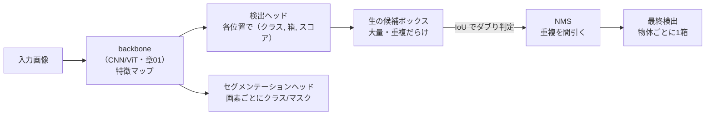
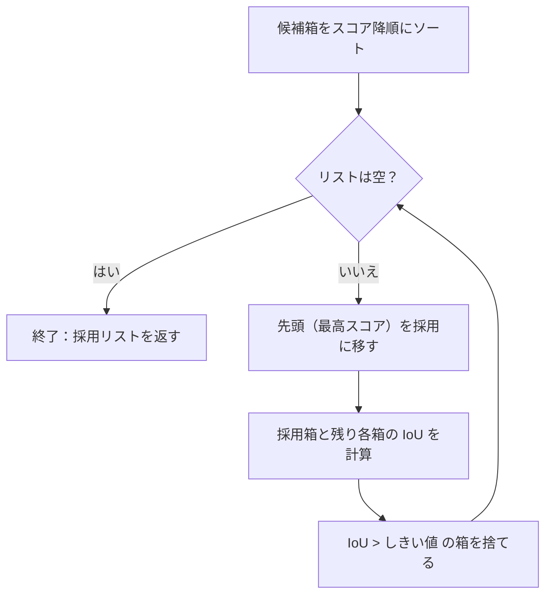
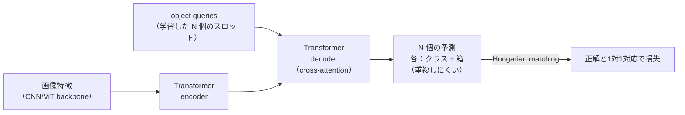

# 物体検出とセグメンテーション

:::abstract[学習目標]
この章を読み終えると、次のことができるようになります。

- 画像分類との違いを **「何が」と「どこに」の2出力** として説明できる
- 物体検出（bbox）とセグメンテーション（画素単位）の **粒度の違い** を区別できる
- **IoU** を定義から計算でき、**NMS（非最大抑制）** の手順を1ステップずつ追える
- **アンカー** ベースと **アンカーフリー** の検出器の違いを述べられる
- **DETR**（Transformer 検出）が NMS とアンカーを **なぜ消せたか** を説明できる
- **SAM**（Segment Anything）が **プロンプト可能なセグメンテーション基盤モデル** である意味を説明できる
:::

## 前提知識

- 章01 [画像表現の基礎（CNN と ViT）](/vision/01-cnn/)：畳み込みによる特徴マップ、受容野、空間的な特徴抽出器（backbone）の役割。検出・セグメンテーションは、この backbone の上に「位置を出す頭（head）」を載せるものとして理解します。
- LLM 出身の読者向けの橋渡し：分類は「画像1枚 → クラス1個」の単出力でしたが、検出は「画像1枚 → 物体ごとに（クラス, 箱）が **可変個**」の出力です。LLM でいう **集合予測（順序なしの可変長出力）** に近い、という見方が後半の DETR で効きます。

:::note[この章の位置づけ]
分類（章01）は「画像全体に1つのラベル」を付けるタスクでした。本章は1段階きめ細かくして、**1枚の画像の中に複数ある物体それぞれの位置と種類** を当てます。さらにきめ細かくして **画素1つずつにラベルを付ける** のがセグメンテーションです。粒度が「画像 → 箱 → 画素」と上がっていく、と捉えてください。
:::

## 直感

私たちが解きたいのは「**この画像に、何が、どこに、いくつあるか**」です。分類器は「この画像は猫です」とまでしか言えません。検出器は「左上に猫、右下に犬」と **位置（どこに）と種類（何が）を同時に** 答えます。

ここで難所が2つあります。

1. **物体の個数が事前に分からない。** 画像によって0個のことも10個のこともあります。出力の長さが固定でない。
2. **同じ物体に対して候補が大量に出る。** 検出器は「猫がいそうな場所」を画像中の無数の位置で試すので、1匹の猫に対して少しずつズレた箱が何十個も出ます。このダブり（重複検出）を **1つの代表に間引く** 仕組みが要ります。

この「重複をどう間引くか」を担うのが **NMS（Non-Maximum Suppression・非最大抑制）** で、その判定に使うのが **IoU（Intersection over Union・重なり率）** です。本章は、この IoU と NMS を核に、検出器の系譜（アンカー → アンカーフリー → DETR）と、セグメンテーションの基盤モデル SAM までを一望します。

## 全体像

検出は「画像 → 候補箱を大量に出す → 間引く → 残りを出力」という流れです。逆に「どこに注目すべきか」を遡れば、各箱が画像のどの領域から来たかが分かります。下図で順方向（生成→抑制）と、IoU/NMS がどこに効くかを先に掴んでください。



検出の出力は **3つ組** です。混同しやすいので先に分けておきます。

| 出力 | 何を表すか | 例 |
| --- | --- | --- |
| **クラス**（何が） | 物体の種類 | "猫" |
| **ボックス**（どこに） | 位置・大きさ $(x_1,y_1,x_2,y_2)$ | 左上(100,100)〜右下(200,200) |
| **スコア**（どれだけ確信） | その箱が本物の物体である確からしさ | 0.92 |

:::warning[スコアと位置は別物]
検出器が出す **スコア（信頼度）** と **位置（箱の座標）** は、別々のヘッドが別々に予測する **独立した出力** です。「スコアが高い＝箱の位置が正確」ではありません。スコア 0.95 でも箱が10ピクセルずれていることはあり得ますし、位置はぴったりでもスコアが低いこともあります。NMS は「スコアの順番」で代表を選び、「IoU（位置の重なり）」でダブりを消す —— **2つの別軸を同時に使う** 手続きだ、と最初に押さえてください。後の節でここが効きます。
:::

セグメンテーションには2種類あります。区別しておきます。

| 種類 | 出力の粒度 | 例 |
| --- | --- | --- |
| **semantic segmentation** | 画素ごとに **クラス** | この画素は「猫」、隣は「背景」 |
| **instance segmentation** | 画素ごとに **どの個体か** | 猫A の画素 / 猫B の画素を区別 |

検出が「箱（粗い四角）」で位置を表すのに対し、セグメンテーションは「**マスク（画素単位の塗り絵）**」で表します。粒度が一段細かい、というのが本質です。

## 理論

### IoU：箱の「重なり率」を1つの数にする

2つの箱がどれだけ重なっているかを、0〜1の1数で測るのが **IoU** です。定義は「**重なり（共通部分）の面積 ÷ 合わせた（和集合）の面積**」。

箱 $A$、箱 $B$ をそれぞれ左上 $(x_1, y_1)$ と右下 $(x_2, y_2)$ で表します。

- $|A \cap B|$：2つの箱が **重なっている矩形** の面積（共通部分・intersection）
- $|A \cup B|$：2つの箱を **合わせた領域** の面積（和集合・union）

IoU は次で定義されます。

$$
\mathrm{IoU}=\frac{|A\cap B|}{|A\cup B|}
$$

意味を1ステップずつ歩きます。

- 2つの箱が **完全一致** → 共通部分 = 和集合 → $\mathrm{IoU}=1$。
- まったく **重ならない** → 共通部分 = 0 → $\mathrm{IoU}=0$。
- 半分だけ重なる → 0 と 1 の間。

ここで「和集合 = 面積A + 面積B」と早合点しないことが大事です。重なっている部分を **二重に数えてしまう** ので、1回引きます。

$$
|A\cup B| = |A| + |B| - |A\cap B|
$$

これが導出（後述）の出発点です。IoU は「重なりを正規化した指標」なので、**箱の絶対サイズに依存しません**（大きい箱でも小さい箱でも、同じ割合の重なりなら同じ IoU）。だから「2つの検出が同じ物体を指しているか」の判定に向きます。

:::note[なぜ「重なり面積そのもの」でなく IoU か]
単に共通部分の面積だけで判定すると、大きい箱ほど共通部分が大きくなり、サイズに引きずられます。和集合で割って **比** にすることで、スケール不変になり「どのくらい同じ場所か」という相対的な重なりだけを取り出せます。
:::

### NMS：重複検出を「最高スコアの代表」に間引く

検出器は1つの物体に対して大量の重複箱を出します。**NMS（非最大抑制）** は、その中から **スコア最大の箱を代表として残し、それと強く重なる箱（＝同じ物体を指している箱）を消す** 手続きです。「非最大（=最大でないもの）を抑制（=消す）」という名前そのままです。

手順（学習しません・**推論時の後処理アルゴリズム**です）。

1. すべての候補箱を **スコアの降順** に並べる。
2. リストの **先頭（残っている中で最高スコア）** を取り、これを「採用」リストに移す。
3. その採用箱と、残りの各箱の **IoU を計算** する。
4. IoU が **しきい値（例 0.5）を超える** 箱は「同じ物体のダブり」とみなして **捨てる**。
5. 残った箱で 2〜4 を繰り返す。リストが空になったら終了。



:::warning[NMS は重複除去であって精度向上ではない]
NMS は **「1物体に1箱」へ整理する後処理** であって、箱の位置を直したりスコアを上げたりは **しません**。残す箱を選ぶだけで、残した箱の座標は1ピクセルも動きません。だから「NMS をかけたら検出が正確になる」は誤解です。やっているのは **見た目の重複を消すこと** だけ。

副作用にも注意。しきい値が **低すぎる** と、本当に隣り合った2匹（重なりの大きい別個体）の片方まで消してしまいます。**高すぎる** と、同じ物体のダブりが残ります。NMS は「重複の定義（IoU しきい値）」というハイパーパラメータに敏感な、あくまで **ヒューリスティックな掃除** です。
:::

### アンカー vs アンカーフリー：候補箱をどう用意するか

検出器は「箱を一から座標で当てる」のではなく、多くの場合 **基準となる箱（anchor・アンカー）** からの **ズレ** を予測します。

- **アンカーベース**（Faster R-CNN, YOLO の旧世代, RetinaNet など）：画像を格子で覆い、各格子点に **あらかじめ決めた形・大きさの基準箱（アンカー）を複数** 置く。検出ヘッドは各アンカーについて「物体があるか（スコア）」と「アンカーからどれだけズラすか（オフセット）」を予測する。
  - 利点：基準があるので学習が安定。
  - 欠点：アンカーの大きさ・縦横比・密度を **手で設計** する必要があり、データに合わないと性能が出ない。1物体に多数のアンカーが当たるので **NMS が必須**。
- **アンカーフリー**（FCOS, CenterNet など）：基準箱を置かず、各位置から **物体の中心までの距離や四辺までの距離を直接回帰** する。
  - 利点：アンカー設計のハイパーパラメータが消える。シンプル。
  - 欠点：それでも1物体に複数位置がヒットするので、**多くは依然 NMS が要る**。

:::note[アンカーは「学習」でなく「設計」]
アンカーの集合（どの大きさ・縦横比を何個置くか）は **固定の設計値** で、学習で動きません。学習で動くのは「各アンカーのスコア」と「アンカーからのオフセット」です。「固定の足場（アンカー）」と「学習する補正（オフセット・スコア）」を分けて捉えると、アンカーフリーが何を消したのかが見えます —— 消したのは **足場の手設計** であって、回帰そのものは残っています。
:::

### DETR：集合予測でアンカーも NMS も消す

**DETR（DEtection TRansformer, 2020）** は、検出を **集合予測（set prediction）問題** として定式化し直し、アンカーと NMS の **両方を不要** にしました。LLM 出身の読者には、ここが一番すっと入る所です。

仕組みの核は2つです。

1. **object queries（物体クエリ）**：学習で得た固定個数（例 100 個）の「スロット」を用意し、Transformer デコーダが画像特徴に cross-attention しながら、**各スロットに高々1つの物体**（クラス + 箱）を割り当てる。スロット数より物体が少なければ余りは "no object"（背景）になる。
2. **Hungarian matching（二部マッチング損失）**：予測100個と正解（例3個）を **1対1で最適に対応付け**（最小コストマッチング）してから損失を取る。「同じ正解に複数の予測が群がる」ことを **損失の段階で禁じる** ので、そもそも重複が生まれにくい。



:::warning[DETR が消したのは「後処理」であって IoU ではない]
DETR は **NMS という後処理** とアンカーを消しましたが、**IoU は消えていません**。Hungarian matching のコスト計算や、箱回帰の損失（GIoU など）の中で IoU はしっかり使われます。「DETR で IoU が要らなくなった」は誤解で、正しくは「**重複を後から掃除する NMS が、損失で重複を禁じる設計に置き換わった**」です。IoU は検出という問題に内在する「箱の一致度」の尺度なので、アーキテクチャが変わっても残ります。
:::

DETR が NMS を消せた理由を一言で言えば、**「重複を生んでから消す」のをやめ、「最初から1物体1予測になるよう学習した」** からです。これは LLM での「ビームサーチで重複を後処理する」のをやめて「モデル自体に多様性を持たせる」のと同じ発想の転換です。

### SAM：プロンプトで何でも切り出す基盤モデル

**SAM（Segment Anything Model, 2023）** は、セグメンテーションを **タスク特化** から **プロンプト可能な基盤モデル** へ移した代表例です。

- 従来のセグメンテーションは「人クラスを切る」「車クラスを切る」のように **学習したクラスしか切れません** でした。
- SAM は **点・ボックス・粗いマスク** などの **プロンプト** を受け取り、「**そこにある物体（クラスを問わず）のマスク**」を返します。クラス名を知らなくても、指された物体を切り出せます。
- これを **SA-1B**（約1100万画像・約10億マスク）という巨大データで学習し、**ゼロショット**（未知の対象でも追加学習なしで）汎化します。

構造は3部品です。

| 部品 | 役割 | いつ動くか |
| --- | --- | --- |
| **image encoder**（重い ViT） | 画像を1回だけエンコードして特徴にする | 画像ごとに1回（重い） |
| **prompt encoder**（軽い） | 点/箱/マスクのプロンプトを埋め込む | プロンプトごと（軽い） |
| **mask decoder**（軽い） | 画像特徴 + プロンプト → マスク | プロンプトごと（軽い） |

:::note[SAM のうまい設計：重い計算を1回に分離]
SAM は **重い image encoder を画像あたり1回** 走らせ、その後は **軽い prompt encoder + mask decoder をプロンプトごとに高速に** 回します。だからユーザーが点を打ち直すたびに、画像全体を再エンコードせず **対話的（リアルタイム）にマスクを出せる**。LLM の KV cache（重い前計算を再利用して軽い増分だけ回す）と同じ「**重い部分を前計算して使い回す**」発想です。後継の **SAM 2（2024）** は、この特徴をストリーミングメモリで時間方向にも持ち越し、**動画** の物体追跡へ拡張しました。
:::

:::warning[SAM は「何が」を答えない]
SAM が返すのは **マスク（どこに）だけ** で、**クラス名（何が）は返しません**。「指された領域の形」を切り出す専門家であって、検出器のように「これは猫」とは言いません。クラスが欲しければ、SAM のマスクと CLIP のような分類器を **組み合わせます**。検出（クラス+箱）とセグメンテーション基盤（マスクのみ）は出力が違う、と押さえてください。
:::

## 数式の導出

NMS の心臓部である IoU を、面積の包除原理から閉じた式に落とします。

軸並行な（傾いていない）箱 $A=(x_1^A, y_1^A, x_2^A, y_2^A)$、$B=(x_1^B, y_1^B, x_2^B, y_2^B)$ を考えます。$(x_1,y_1)$ が左上、$(x_2,y_2)$ が右下で、$x_2>x_1,\ y_2>y_1$ とします。

**ステップ1：各箱の面積。** 幅 × 高さ です。

$$
|A| = (x_2^A - x_1^A)\,(y_2^A - y_1^A), \qquad |B| = (x_2^B - x_1^B)\,(y_2^B - y_1^B)
$$

**ステップ2：共通部分の矩形。** 2つの軸並行矩形の共通部分も軸並行矩形になります。その左上は「両者の左上の **右下側**」、右下は「両者の右下の **左上側**」です。各軸独立に決まります。

$$
x_1^I = \max(x_1^A, x_1^B), \quad y_1^I = \max(y_1^A, y_1^B)
$$

$$
x_2^I = \min(x_2^A, x_2^B), \quad y_2^I = \min(y_2^A, y_2^B)
$$

**ステップ3：共通部分の面積（重なりがない場合の処理）。** 幅・高さが負になり得ます（重ならないと右端より左端が右に来る）。負は「重なりゼロ」を意味するので 0 でクリップします。

$$
w_I = \max(0,\; x_2^I - x_1^I), \qquad h_I = \max(0,\; y_2^I - y_1^I)
$$

$$
|A\cap B| = w_I \cdot h_I
$$

**ステップ4：和集合の面積（包除原理）。** 単純に足すと共通部分を二重に数えるので、1回引きます。

$$
|A\cup B| = |A| + |B| - |A\cap B|
$$

**ステップ5：IoU。** 定義に代入します。

$$
\mathrm{IoU}(A,B)=\frac{|A\cap B|}{|A\cup B|}=\frac{w_I\,h_I}{|A| + |B| - w_I\,h_I}
$$

退化ケースの確認をしておきます。

- 完全一致：$|A\cap B|=|A|=|B|$ なので分母 $=|A|$、$\mathrm{IoU}=1$。境界の最大値。
- 非重複：$w_I$ か $h_I$ が 0 にクリップされ $|A\cap B|=0$、$\mathrm{IoU}=0$。境界の最小値。
- 分母が 0（両方とも面積 0 の退化箱）：未定義なので実装では 0 を返します。

$\blacksquare$

## 実装

IoU と NMS を numpy だけで実装し、**1つの物体に対する3つの重複候補 + 別物体1つ** という入力で、NMS が代表を1つずつ残すのを実測します。

```python title="iou_nms.py"
import numpy as np

def iou(box_a, box_b):
    # 箱は (x1, y1, x2, y2)。左上と右下。
    ax1, ay1, ax2, ay2 = box_a
    bx1, by1, bx2, by2 = box_b
    # 共通部分の矩形（各軸独立に max/min）
    ix1, iy1 = max(ax1, bx1), max(ay1, by1)
    ix2, iy2 = min(ax2, bx2), min(ay2, by2)
    # 幅・高さは負を 0 にクリップ（重ならなければ重なり面積 0）
    iw, ih = max(0.0, ix2 - ix1), max(0.0, iy2 - iy1)
    inter = iw * ih
    area_a = (ax2 - ax1) * (ay2 - ay1)
    area_b = (bx2 - bx1) * (by2 - by1)
    union = area_a + area_b - inter      # 包除原理：二重計上を1回引く
    return inter / union if union > 0 else 0.0

def nms(boxes, scores, iou_thr=0.5):
    idxs = np.argsort(scores)[::-1]      # スコア降順（最高スコアが先頭）
    keep = []
    while idxs.size > 0:
        i = idxs[0]                      # 残った中の最高スコアを代表に採用
        keep.append(int(i))
        rest = idxs[1:]
        survivors = []
        for j in rest:
            # 代表と強く重なる箱＝同じ物体のダブり → 捨てる
            if iou(boxes[i], boxes[j]) <= iou_thr:
                survivors.append(j)      # 重なりが薄いものだけ次ラウンドへ残す
        idxs = np.array(survivors, dtype=int)
    return keep

# 1つの本物の物体Aに対し近接した3候補 + 別物体Bの1候補
boxes = np.array([
    [100, 100, 200, 200],   # 0: 物体A 本命（最高スコア）
    [108, 105, 205, 198],   # 1: 物体A 重複（スコアやや低）
    [ 95,  98, 198, 203],   # 2: 物体A 重複（さらに低）
    [300, 300, 400, 420],   # 3: 物体B（別物体・離れている）
], dtype=float)
scores = np.array([0.92, 0.88, 0.75, 0.81])

print("IoU(0,1) =", round(iou(boxes[0], boxes[1]), 4))
print("IoU(0,2) =", round(iou(boxes[0], boxes[2]), 4))
print("IoU(0,3) =", round(iou(boxes[0], boxes[3]), 4))
keep = nms(boxes, scores, iou_thr=0.5)
print("NMS keep indices =", keep)
print("kept scores =", [round(float(scores[i]), 2) for i in keep])
```

```text title="出力"
IoU(0,1) = 0.8176
IoU(0,2) = 0.8897
IoU(0,3) = 0.0
NMS keep indices = [0, 3]
kept scores = [0.92, 0.81]
```

読み取りましょう。

- 箱0と箱1、箱0と箱2 は IoU が 0.82, 0.89 と高い ＝ **同じ物体A** を指す重複。しきい値 0.5 を超えるので NMS で消えます。
- 箱0と箱3 は IoU が 0.0 ＝ **離れた別物体B**。消えません。
- 結果 `keep = [0, 3]` ：物体A の代表として **最高スコアの箱0（スコア 0.92）**、物体B として **箱3（スコア 0.81）** が残りました。スコア 0.88 の箱1 は「2番目に高いが、より高い箱0 と重なる」ので落ちています —— **スコアの順番（残す優先度）と IoF の重なり（消す条件）が別軸** で効いている様子が、ここに出ています。

:::note[実装メモ：スコアが位置を直さないことの確認]
出力に注目すると、NMS は箱の座標を一切書き換えず、**インデックスを選んでいるだけ** です。残った箱0 の座標は入力のまま `[100,100,200,200]`。NMS は掃除であって補正ではない、という §理論 の主張が、コードのレベルでも `keep`（選択）しか返さないことに表れています。
:::

## 演習

::::question[演習 1: IoU を手で計算する]
箱 $A=(0,0,10,10)$、箱 $B=(5,5,15,15)$ があります。(a) 共通部分の矩形の座標と面積を求めてください。(b) 各箱の面積と和集合の面積を求めてください。(c) IoU を求めてください。

:::details[解答]
(a) 共通部分は各軸で内側を取ります。左上 $x_1^I=\max(0,5)=5$, $y_1^I=\max(0,5)=5$、右下 $x_2^I=\min(10,15)=10$, $y_2^I=\min(10,15)=10$。よって共通矩形は $(5,5,10,10)$、幅 $=10-5=5$、高さ $=5$、**面積 $=25$**。

(b) $|A|=(10-0)(10-0)=100$、$|B|=(15-5)(15-5)=100$。和集合は包除原理で $|A\cup B| = 100 + 100 - 25 = \mathbf{175}$。

(c) $\mathrm{IoU} = \dfrac{25}{175} = \dfrac{1}{7} \approx \mathbf{0.143}$。重なりはあるが小さい、と読めます（しきい値 0.5 の NMS なら「別物体」扱いで両方残る）。
:::
::::

::::question[演習 2: NMS の挙動としきい値]
候補箱が4つあり、スコアは $[0.9, 0.85, 0.8, 0.6]$、箱0と箱1の IoU は 0.7、箱0と箱2の IoU は 0.3、箱3はどれとも IoU 0 とします。(a) しきい値 0.5 の NMS で残る箱はどれですか。(b) しきい値を 0.2 に下げると結果はどう変わりますか。(c) この例から「NMS は精度を上げるか」を一言で。

:::details[解答]
(a) スコア降順は箱0(0.9), 箱1(0.85), 箱2(0.8), 箱3(0.6)。まず **箱0を採用**。箱0との IoU は 箱1=0.7（>0.5 で消す）、箱2=0.3（≤0.5 で残す）、箱3=0（残す）。次に残りの先頭 **箱2を採用**（箱3 とは IoU 0 で残る）。最後に **箱3を採用**。結果は **箱0, 箱2, 箱3**。

(b) しきい値 0.2 では、箱0採用時に 箱2(IoU 0.3) も >0.2 で **消える**。残るのは **箱0, 箱3** のみ。しきい値を下げるほど「重複とみなす範囲」が広がり、近い箱が消えやすくなります（隣接物体を潰す危険も増す）。

(c) **上げません。** NMS は残す箱を選ぶだけで、箱の位置やスコアは変えません。重複を間引く後処理であって、検出そのものの精度を改善する手続きではありません。
:::
::::

## まとめ

:::success[この章の要点]
- 検出は「**何が（クラス）・どこに（箱）・どれだけ確信（スコア）**」の3つ組を、物体ごとに **可変個** 出すタスク。スコアと位置は別ヘッドの **独立出力**。
- **IoU** は「重なり ÷ 和集合」で箱の一致度を 0〜1 に正規化する。スケール不変なので「同じ物体か」の判定に使える。
- **NMS** はスコア降順で代表を残し、IoU がしきい値超の重複を捨てる **後処理**。重複除去であって **精度向上ではない**。
- **アンカー** は手設計の足場、**アンカーフリー** はそれを消すが回帰と NMS は残る。**DETR** は集合予測 + Hungarian matching で **NMS とアンカーの両方を消した**（IoU は損失内に残る）。
- **SAM** は点/箱/マスクのプロンプトで任意物体を切り出す **セグメンテーション基盤モデル**。重い encoder を1回・軽い decoder をプロンプトごとに回す設計で対話的。クラス名（何が）は返さない。
:::

### 次に学ぶこと

ここまでで「何がどこに」を答える検出と、画素単位のセグメンテーションの **道具立て（IoU・NMS・アンカー・DETR・SAM）** が手に入りました。次章では、視覚モダリティ全体を俯瞰し、認識（理解）から生成への流れ、CNN→ViT→収束、自己教師あり表現学習、基盤モデル化という大きな地図の中に、本章の検出・セグメンテーションを位置づけます。

→ [次章：視覚の全体地図](/vision/06-vision-landscape/)

## 用語ミニ辞典

| 用語 | 一言 |
| --- | --- |
| 物体検出 (detection) | 物体ごとに（クラス, 箱, スコア）を可変個出すタスク |
| bounding box | 物体を囲む軸並行矩形 $(x_1,y_1,x_2,y_2)$ |
| IoU | 重なり÷和集合。箱の一致度を 0〜1 に正規化 |
| NMS | スコア降順で代表を残し IoU 超の重複を消す後処理 |
| confidence score | その箱が本物の物体である確からしさ（位置とは独立） |
| anchor | 手設計の基準箱。ここからのズレを学習する足場 |
| anchor-free | 基準箱を置かず中心/四辺距離を直接回帰する方式 |
| DETR | Transformer で集合予測。NMS とアンカーを不要にした |
| object query | DETR の物体スロット。各1個の物体を担当 |
| Hungarian matching | 予測と正解を1対1最適対応させる損失 |
| semantic segmentation | 画素ごとに **クラス** を付ける |
| instance segmentation | 画素ごとに **どの個体か** を区別する |
| SAM | プロンプト可能なセグメンテーション基盤モデル |
| SA-1B | SAM の学習データ（約11M画像・約10億マスク） |

## 次のアクション

理論を手で定着させる。**最小の写経 → 動かす → 小実験** を1セットで。

1. 上の `iou_nms.py` をそのまま写経し、`uv run --with numpy python iou_nms.py` で実行して、`IoU(0,1)=0.8176` と `keep=[0,3]` を自分の手元で再現する。
2. `iou_thr` を 0.9 に上げて再実行し、重複（箱1・箱2）が消えずに残ることを確認する。**しきい値が「重複の定義」を決める**ことを実測する。
3. 余力があれば、`scores` を入れ替えて（例：箱2 を最高スコアにする）、NMS が「位置でなくスコアで代表を選ぶ」ことを確かめる。残る箱の **座標が NMS で変わらない**（選ぶだけ）ことも確認する。

ここまでで検出の後処理（IoU/NMS）が手に馴染みます。次章で視覚全体の地図を描き、検出・セグメンテーションを大きな流れの中に置きます。

## 参考文献

1. S. Ren, K. He, R. Girshick, J. Sun, "Faster R-CNN: Towards Real-Time Object Detection with Region Proposal Networks," *NeurIPS*, 2015.（アンカーベース検出・RPN）
2. T.-Y. Lin et al., "Focal Loss for Dense Object Detection (RetinaNet)," *ICCV*, 2017.
3. Z. Tian, C. Shen, H. Chen, T. He, "FCOS: Fully Convolutional One-Stage Object Detection," *ICCV*, 2019.（アンカーフリー）
4. N. Carion et al., "End-to-End Object Detection with Transformers (DETR)," *ECCV*, 2020.
5. H. Rezatofighi et al., "Generalized Intersection over Union (GIoU)," *CVPR*, 2019.（IoU ベースの損失）
6. A. Kirillov et al., "Segment Anything (SAM)," *ICCV*, 2023.（SA-1B・プロンプト可能セグメンテーション）
7. N. Ravi et al., "SAM 2: Segment Anything in Images and Videos," Meta AI, 2024.（動画への拡張）
