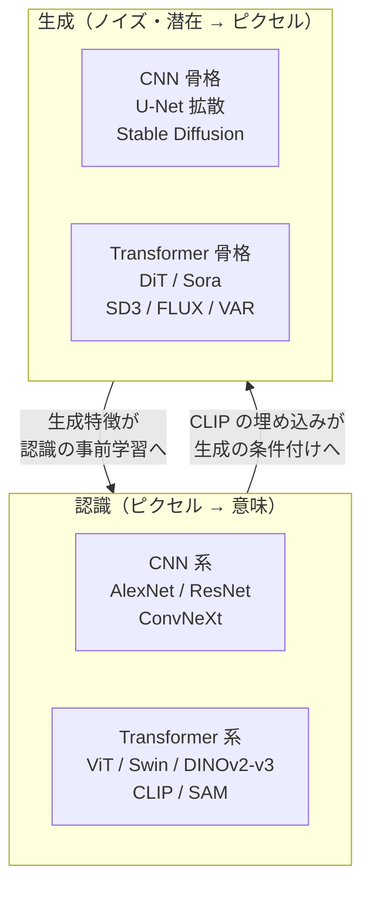
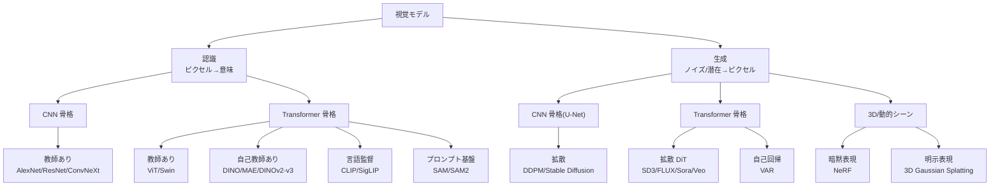
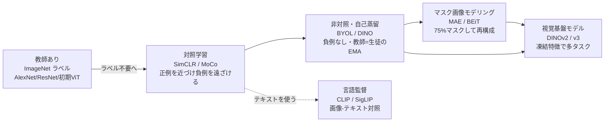
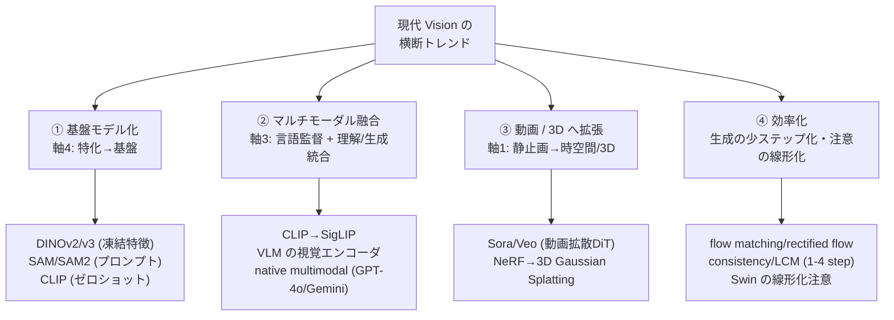

# 現代 Vision の地図 — 基盤モデル・動画・3D・トレンド

:::abstract[学習目標]
この章を読み終えると、次のことができるようになります。

- 視覚モデルを **4つの直交する軸**（認識/生成・CNN/ViT・教師あり/自己教師あり・識別/基盤）で分類し、任意のモデルを軸上に **配置** できる
- **AlexNet → ResNet → ViT → CLIP → 拡散/Stable Diffusion → SAM → DiT → Sora → DINOv3** という代表研究の流れを、何が動機で次へ進んだかという **因果** で説明できる
- **4つの横断トレンド**（基盤モデル化・マルチモーダル融合・動画/3D・効率化）を、具体的な代表研究と結びつけて **列挙** できる
- 既習の **自己教師あり学習**・**拡散生成** が地図のどこに位置し、なぜ重要かを **位置づけ** られる
- 視覚から **マルチモーダル**（CLIP/VLM）への橋がどこに架かるかを **指し示せる**
:::

## 前提知識

- 章03 [自己教師あり表現学習](/vision/03-self-supervised/)：対照学習（InfoNCE）・自己蒸留・マスク再構成。本章の「教師あり vs 自己教師あり」軸の中身
- 章04 [拡散モデルによる画像生成](/vision/04-diffusion-generation/)：前向き拡散と逆向きデノイジング。本章の「認識 vs 生成」軸の生成側
- 画像表現の基礎（CNN の畳み込み／ViT のパッチ分割＝トークン化）：本章の「CNN vs ViT」軸の前提

この章は **新しい技術を1つ深掘りする章ではありません**。これまで学んだ部品（自己教師あり・拡散・ViT）が、視覚という大きな地図の **どこに位置し、互いにどうつながるか** を一望する **俯瞰の章** です。LLM 出身の読者なら、「トランスフォーマー一族の系統樹」を1枚にまとめる作業の視覚版だと思ってください。

## 直感

視覚分野は2010年代以降、論文の数も用語も爆発的に増えました。AlexNet、ResNet、ViT、CLIP、Stable Diffusion、SAM、Sora、NeRF、Gaussian Splatting、DINOv2/v3…… 名前だけ追うと、互いに無関係な発明が乱立しているように見えます。

しかし一歩引くと、これらは **少数の問い** への異なる回答にすぎません。問いはたとえばこうです。

- **何を解くのか** —— ピクセルから意味を取り出す（認識）のか、意味からピクセルを作る（生成）のか。
- **どんな骨格で** —— 局所性に強い畳み込み（CNN）か、大域依存に強い自己注意（Transformer）か。
- **何を教師信号に** —— 人がつけたラベルか、ラベルなしのデータそのものか、web の画像-テキストペアか。
- **どこまで汎用に** —— 1タスク専用か、微調整なしで多タスクへ転用できる基盤モデルか。

本章のゴールは、この **4つの問い＝4つの軸** で座標系を作り、主要な研究をその上に置くことです。座標系さえ手に入れば、次に出会う新しいモデルも「ああ、あの軸のあの位置だ」と即座に位置づけられます。地図を持つこと —— それがこの章で得るものです。

## 全体像

視覚の地図を、まず **2つの大きな問い（タスクの方向 × 骨格の機構）** で4象限に分け、そこに代表研究を置きます。



縦が **タスクの方向**（認識／生成）、各段の左右が **骨格**（CNN／Transformer）です。重要なのは、2020年代に **両方向とも骨格が CNN から Transformer へ移った** こと（右側が増殖した）、そして認識と生成が **CLIP の埋め込み** を介して双方向に行き来するようになったことです。

:::note[LLM ↔ Vision]
LLM の世界も、RNN/LSTM から Transformer へ骨格が一本化し、その後「言語理解（BERT 系）」と「言語生成（GPT 系）」が大規模事前学習で収斂しました。視覚はこれを **約3年遅れで、ほぼ同じ筋書きでなぞっています** —— 骨格の Transformer 化、自己教師あり事前学習、スケーリング則、そして理解と生成の統合。LLM で起きたことを思い出すと、視覚の次の一手が読めます。
:::

### 4つの分類軸（座標系）

地図の座標系は4本の軸です。これらは **互いに直交** します（1つの軸の値が他を決めない）。たとえば CLIP は「認識／Transformer／言語監督／基盤」、Stable Diffusion は「生成／CNN骨格(U-Net)／（テキスト条件）／タスク特化寄りだが汎用」のように、各モデルは4軸の座標として表せます。

| 軸 | 一方の極 | もう一方の極 | 何を分けるか |
| --- | --- | --- | --- |
| **タスクの方向** | 認識（ピクセル→意味） | 生成（ノイズ/潜在→ピクセル） | 入出力の向き。最も基本の軸 |
| **骨格の機構** | CNN（畳み込み・局所） | Transformer（自己注意・大域） | 特徴抽出/生成の中核機構 |
| **監督信号** | 教師あり（ラベル） | 自己教師あり（ラベル不要）／言語監督 | 表現を何で学ぶか |
| **汎用性** | タスク特化モデル | 汎用基盤モデル（凍結特徴/プロンプト/ゼロショット） | 1タスク専用か多タスク転用か |

地図上の主要モデルを、この4軸の座標として一覧にすると次のようになります。**1つの行＝1モデルの「住所」** です。空欄や「—」は「その軸では中立／非該当」を意味します。

| モデル | 方向 | 骨格 | 監督信号 | 汎用性 |
| --- | --- | --- | --- | --- |
| AlexNet / ResNet | 認識 | CNN | 教師あり | タスク特化 |
| ViT | 認識 | Transformer | 教師あり（初期） | タスク特化〜汎用 |
| ConvNeXt | 認識 | CNN | 教師あり | タスク特化 |
| DINOv2 / v3 | 認識 | Transformer | 自己教師あり | 基盤（凍結特徴） |
| CLIP / SigLIP | 認識 | Transformer | 言語監督 | 基盤（ゼロショット） |
| SAM / SAM 2 | 認識 | Transformer | 教師あり（大規模注釈） | 基盤（プロンプト） |
| Stable Diffusion | 生成 | CNN（U-Net） | テキスト条件 | 汎用寄り |
| DiT / SD3 / FLUX | 生成 | Transformer | テキスト条件 | 汎用寄り |
| Sora / Veo | 生成 | Transformer | テキスト条件（動画） | 汎用（world sim） |

:::warning[「軸」を「時代」と取り違えない]
「CNN は古く Transformer が新しい」「教師あり→自己教師ありで前者は時代遅れ」と直線的に読むのは誤りです。これらは **時系列ではなく直交する設計選択** です。ConvNeXt（2022）は最新の知見で純 CNN を磨き直した研究ですし、教師あり学習は今も多くの実務の主力です。軸は「優劣の順位」ではなく「設計空間の座標」です —— 古い極にも現役の研究があります。
:::

### 分類ツリー：地図を1本の樹に畳む

4軸の座標表を、上から枝分かれする1本の **分類ツリー** に畳むと、新しいモデルに出会ったとき「どの枝を下りるか」で住所が決まります。一番上の分かれ目が **タスクの方向**（最も基本の軸）、次が **骨格**、葉に代表モデルを置きます。



:::note[ツリーと座標表は同じ地図の2つの見方]
上の **分類ツリー**（枝分かれ）と、前の **座標表**（行＝モデル, 列＝軸）は、同じ4軸地図を別の角度から見たものです。ツリーは「新しいモデルをどう辿って分類するか」の手順向き、座標表は「2つのモデルを軸ごとに比べる」対比向き。地図を歩くときはツリー、地図上の距離を測るときは座標表、と使い分けてください。
:::

## 理論：4つの軸を1つずつ降りる

座標系の各軸が「何を・なぜ分けるのか」を、代表研究と結びつけて掘ります。ここが地図の本体です。

### 軸1：認識 vs 生成（タスクの方向）

最も基本の軸です。**認識（recognition / understanding）** は画像・動画を入力に、分類・検出・セグメンテーション・深度などの **意味** を出力します。**生成（generation）** はノイズや潜在変数・テキストから **ピクセル** を合成します。

- **認識側の動作**：入力ピクセル $x$ → エンコーダ → 表現 $z$ → 意味（ラベル/マスク/深度）。情報は **圧縮** される方向（高次元ピクセル → 低次元意味）。代表＝AlexNet, ResNet, ViT, DINOv2/v3, SAM。
- **生成側の動作**：ノイズ/潜在 $z$（＋テキスト条件 $c$）→ デコーダ/逆拡散 → ピクセル $x$。情報は **展開** される方向（低次元種 → 高次元ピクセル）。代表＝DDPM, Stable Diffusion, DiT, Sora, NeRF。

:::note[2020年代の収斂]
この2系統は **入出力の向きとしては今も直交** しますが、**道具立ては収斂** しました。同じ Transformer 骨格、同じ大規模事前学習、同じスケーリング則を共有します。さらに CLIP のような表現は認識側で学ばれますが、生成モデルの **条件付け**（テキスト→画像のテキスト理解）にも使われ、両系統を橋渡しします。本章末の [実装](#実装) で、認識側の核（CLIP の対照整列）と生成側の核（前向き拡散）を、それぞれ最小コードで触ります。
:::

### 軸2：CNN vs Transformer（骨格の機構）

特徴抽出・生成の **中核機構** を分ける軸です。両者は対照的な **帰納バイアス（inductive bias）** を持ちます。

| | CNN（畳み込み） | Transformer（自己注意） |
| --- | --- | --- |
| 強い前提 | 局所性・並進不変性 | （弱い前提）任意の2位置を直接結ぶ |
| 得意 | 局所パターン（エッジ・テクスチャ） | 大域依存（画像全体の文脈） |
| データ要求 | 少なくても効く | **大規模事前学習が必須** |
| 計算量 | 受容野に比例 | 系列長 $L$ に対し $O(L^2)$ |
| 代表 | AlexNet, ResNet, U-Net, ConvNeXt | ViT, Swin, DiT, Sora |

- **CNN の帰納バイアス**：畳み込みは「近くのピクセルは関係が深い」「物体は位置がずれても同じ物体」という前提を **構造として埋め込み** ます。だから少ないデータでも効きますが、その前提が受容野＝カーネル幅に縛られ、画像全体の文脈には届きにくい。
- **Transformer の弱い前提**：ViT は画像を $16\times16$ パッチに分割し、各パッチを **トークン** として自己注意に入れます（LLM のトークン化と同じ発想）。位置の事前知識がほとんどない代わりに、**十分なデータがあれば** 局所性すら自分で学習し、CNN を上回ります。

:::warning[ViT は「データがあれば」CNN を超える、の but]
ViT が CNN を上回るのは **大規模事前学習データがあるとき** です。小さなデータセットでスクラッチ学習すると、帰納バイアスの強い CNN の方が勝つことがしばしばあります。「ViT > CNN」は無条件命題ではなく **データ量に条件づいた命題** です。ここを落とすと、小データ問題で ViT を選んで失敗します。
:::

**収斂の証拠（Swin と ConvNeXt）。** 興味深いのは、両極が互いに歩み寄ったことです。**Swin Transformer** はウィンドウ内に注意を制限し計算量を系列長に線形化、CNN 的な階層構造（局所→大域）を Transformer に取り込みました。逆に **ConvNeXt** は ViT の設計（大カーネル・LayerNorm・GELU・逆ボトルネック）を **純 CNN に移植** し、Transformer 同等の精度を畳み込みの効率のまま達成しました。設計が相互に収束した —— これが「CNN vs Transformer は時代ではなく軸だ」の最も強い証拠です。

### 軸3：教師あり vs 自己教師あり（監督信号）

表現を **何の信号で学ぶか** の軸です。重心が大きく移動した軸でもあります。詳しくは章03 [自己教師あり表現学習](/vision/03-self-supervised/) で扱いますが、地図上の位置づけを与えます。



- **教師あり**：ImageNet などの人手ラベルで分類を学ぶ。最も古典的で、今も実務の主力。
- **自己教師あり（SSL）**：ラベルなしの **前タスク（pretext task）** から汎用特徴を学ぶ。対照学習（SimCLR/MoCo）→ 非対照・自己蒸留（BYOL/DINO）→ マスク画像モデリング（MAE/BEiT）と多様化し、**DINOv2/v3** がこれらを融合しました。
- **言語監督**：web の画像-テキストペアを対照学習で結ぶ **弱教師あり**（CLIP/SigLIP）。固定ラベルを「自然言語」に置き換えたことが鍵で、未学習クラスを **プロンプト** で分類できます（ゼロショット）。

SSL の各流派を、地図上で対比表として固定します。**同じ「ラベルなし」でも前タスクの設計思想がまったく違う** ことが読み取りポイントです。

| 流派 | 代表 | 前タスク（何を当てるか） | 負例 | 特徴 |
| --- | --- | --- | --- | --- |
| 対照学習 | SimCLR / MoCo | 同じ画像の2 view を近づける | **必要**（大バッチ or キュー） | 直感的だが負例の質に敏感 |
| 非対照・自己蒸留 | BYOL / DINO | 生徒が教師（EMA）の出力に一致 | **不要** | 崩壊を避ける工夫が要、ViT と相性良 |
| マスク再構成 | MAE / BEiT | マスクした 75% を復元 | 不要 | 生成的、デコーダで再構成 |
| 言語監督 | CLIP / SigLIP | 画像と正しいテキストを対応づけ | （ペア内の他テキスト） | ゼロショット分類が可能に |
| 融合 | DINOv2 / v3 | 自己蒸留＋マスク＋大規模データ整備 | 不要 | 凍結特徴で多タスク、視覚基盤の決定版 |

:::note[重心移動の意味]
重心は「教師あり → 自己教師あり」へ移りました。理由は **スケール** です。ラベル付けは人手のコストで頭打ちになりますが、ラベルなしデータは web に無尽蔵にあります。**DINOv3（2025）は SSL が弱教師ありモデルを広範な凍結特徴タスクで初めて上回ったと報告** しました。LLM で「ラベルなしテキストの自己教師あり事前学習」が主役になったのと同じ力学が、視覚でも働いています。
:::

### 軸4：識別モデル vs 基盤モデル（汎用性）

1タスク専用か、微調整なしで多タスクへ転用できる汎用モデルかの軸です。**評価の軸そのものが変わった** ことを意味します。

- **タスク特化モデル**：個別タスク（特定の分類・特定のセグメンテーション）向けに学習・微調整する。評価は「そのタスクの精度」。
- **視覚基盤モデル（visual foundation model）**：大規模事前学習で得た能力を、**凍結特徴**・**プロンプト**・**言語** で多数の下流タスクへ転用する。

| 基盤モデル | 転用の形 | 何を入力にタスクを指定するか |
| --- | --- | --- |
| **DINOv2/v3** | 凍結特徴 | 特徴をそのまま使い、軽い線形層を載せる（分類・セグメンテーション・深度） |
| **SAM/SAM2** | プロンプト | 点/ボックス/マスクを与えると任意物体のマスクを出す（SAM2 は動画も） |
| **CLIP** | 言語プロンプト | テキスト（クラス名）を与えゼロショット分類 |
| **Sora** | テキスト | プロンプトから動画を生成（world simulator） |

:::warning[「基盤モデル」を「大きいモデル」と混同しない]
基盤モデルの本質は **サイズ** ではなく **転用形態** です。大きくても1タスク専用なら基盤モデルではありませんし、転用可能なら相対的に小さくても基盤モデルです。鍵は「**微調整なしで（あるいは凍結特徴のまま）複数の下流タスクをこなせるか**」。評価軸が「分類精度」から「微調整なしの汎用性・頑健性・ゼロショット転移」へ拡大した、という変化が軸4の正体です。
:::

:::note[「基盤」への転用形態は3つに分かれる]
基盤モデルといっても、下流タスクへの「つなぎ方」は3様です。**(1) 凍結特徴**（DINOv2/v3：特徴を出すだけで触らず、上に軽い層を載せる）、**(2) プロンプト**（SAM：点やボックスでタスクを指定）、**(3) 言語**（CLIP/Sora：自然言語でタスクを指定）。LLM が「プロンプトで多タスク」を実現したのと同じ汎用化が、視覚では3つの異なる入口で起きています。新しいモデルを見たら「どの入口で転用するのか」を問うと、基盤性の正体が掴めます。
:::

## 数式の導出：軸を貫く2本の数式

地図の章なので導出は軽くします。ただし **「認識の核」と「生成の核」をそれぞれ1本の式で押さえる** と、地図全体に背骨が通ります。後の [実装](#実装) はこの2式をそのまま動かします。

### 認識の核：対照整列（CLIP の InfoNCE）

認識側の現代の心臓は、**画像とテキストを同じ空間に整列させる対照損失** です。$N$ 個の画像-テキストペアがあり、$i$ 番目の画像埋め込みを $\mathbf{I}_i$、テキスト埋め込みを $\mathbf{T}_j$ とします。両者は単位ベクトルに正規化済み（$\lVert\mathbf{I}_i\rVert=\lVert\mathbf{T}_j\rVert=1$）とします。

類似度を内積（＝cos 類似度）で測り、温度 $\tau$ で割ってロジットにします。画像 $i$ が正しいテキスト $i$ を選ぶ確率は softmax で、

$$
P(i\to i)=\frac{\exp\!\big(\mathbf{I}_i^\top \mathbf{T}_i/\tau\big)}{\sum_{j=1}^{N}\exp\!\big(\mathbf{I}_i^\top \mathbf{T}_j/\tau\big)}
$$

画像→テキスト方向の損失は、正ペアの負の対数尤度をバッチで平均したものです。

$$
L_{i\to t}=-\frac{1}{N}\sum_{i=1}^{N}\log P(i\to i)
$$

テキスト→画像方向 $L_{t\to i}$ も対称に定義し、CLIP は両者を平均します。

$$
L_{\mathrm{CLIP}}=\tfrac{1}{2}\big(L_{i\to t}+L_{t\to i}\big)
$$

ここで記号の役割を押さえます。$\mathbf{I}_i^\top \mathbf{T}_i$（対角）は **正ペアの類似度**で大きくしたい量、$\mathbf{I}_i^\top \mathbf{T}_j\ (j\neq i)$（非対角）は **負ペアの類似度**で小さくしたい量です。温度 $\tau$ は分布の鋭さを決め、小さいほど「正ペアだけ突出させる」圧力が強まります。この式が **言語監督・ゼロショット分類・VLM の視覚エンコーダ** すべての出発点です。 $\blacksquare$

### 生成の核：前向き拡散（DDPM の閉形式）

生成側の現代の心臓は **拡散** です（章04の主題）。データ $x_0$ にノイズを段階的に加える前向き過程は、任意ステップ $t$ について **閉形式** で書けます。

$$
x_t=\sqrt{\bar\alpha_t}\,x_0+\sqrt{1-\bar\alpha_t}\,\epsilon,\qquad \epsilon\sim\mathcal{N}(0,I)
$$

ここで $\bar\alpha_t=\prod_{s\le t}(1-\beta_s)$ は **ノイズスケジュール** $\beta_s$ の累積です。役割を押さえます。$\sqrt{\bar\alpha_t}$ は **元データの残り具合**（$t$ が進むと 0 へ）、$\sqrt{1-\bar\alpha_t}$ は **混ぜたノイズの量**（$t$ が進むと 1 へ）。$t\to T$ で $\bar\alpha_t\to 0$ となり、$x_t$ は元データ構造を失って標準正規 $\mathcal{N}(0,I)$ に収束します。

**生成（逆過程）はこの矢印を逆にたどる** 操作です。$\mathcal{N}(0,I)$ から出発し、各ステップで「混ざったノイズ $\epsilon$」を予測して少しずつ除去（デノイズ）し、$x_0$ へ戻します。学習は「ノイズ予測の二乗誤差」で、これが章04で導出する DDPM 損失 $L_{\mathrm{simple}}=\mathbb{E}\big[\lVert\epsilon-\epsilon_\theta(x_t,t)\rVert^2\big]$ です。本章では **前向きの閉形式だけ** を [実装](#実装) で確かめ、「データがノイズへ崩れていく」軸を体感します。 $\blacksquare$

:::note[2式が地図に背骨を通す]
$L_{\mathrm{CLIP}}$ は **認識軸**（ピクセル→意味の整列）、前向き拡散は **生成軸**（ノイズ↔ピクセル）の核です。この2本を握っておけば、SigLIP（CLIP の損失を sigmoid 化）、DiT（拡散の骨格を Transformer 化）、Sora（拡散を時空間パッチへ）など、ほとんどの派生は「この核のどこをいじったか」で読めます。
:::

:::note[生成の第3経路：flow matching と自己回帰]
拡散は生成の唯一解ではありません。**flow matching / rectified flow**（後述のトレンドで詳述）は、同じ「ノイズ↔データ」を **曲がった拡散軌道ではなく直線の輸送経路** で結び直す一般化で、SD3・FLUX・Veo が採用しました。さらに **VAR（2024）** は画像を「次のスケール」を当てる自己回帰として解き、拡散を上回る FID を報告しました。前向き拡散の式は生成軸の入口に過ぎず、そこから flow（軌道を直線化）と AR（軸を時間/スケール方向へ）の2方向に枝が伸びる、と捉えてください。
:::

## 実装

地図の章なので、深掘りは章03/04に譲り、ここでは **軸1（認識 vs 生成）の両極を、最小の numpy で1回ずつ触る** ことに絞ります。認識の核＝CLIP 対照整列、生成の核＝前向き拡散です。どちらも上の数式をそのまま動かします（実測出力併記）。

### 認識の核：CLIP 対照整列のミニチュア

$N=4$ 個の (画像, テキスト) ペアを作り、正ペアが対角に並ぶ類似度行列を組み、$L_{\mathrm{CLIP}}$ を計算します。「同じ概念だが別モダリティ」を、共通の概念ベクトルに別々のノイズを足して模します。

```python title="clip_toy.py"
import numpy as np

rng = np.random.default_rng(0)

# 4 個の (画像, テキスト) ペア。正しいペアは対角線。
N, d = 4, 8

# 各ペアの「真の意味ベクトル」を作り、画像側・テキスト側に
# 別々のノイズを足して「同じ概念だが別モダリティの埋め込み」を模す。
concept = rng.normal(size=(N, d))
img = concept + 0.3 * rng.normal(size=(N, d))   # 画像エンコーダ出力の代理
txt = concept + 0.3 * rng.normal(size=(N, d))   # テキストエンコーダ出力の代理

def l2norm(x):
    # CLIP は単位球面上で内積（=cos 類似度）を取る
    return x / np.linalg.norm(x, axis=1, keepdims=True)

img, txt = l2norm(img), l2norm(txt)

tau = 0.07                      # 温度。小さいほど分布が鋭くなる
logits = (img @ txt.T) / tau    # (N,N) 類似度行列 / 温度

def softmax_rows(z):
    z = z - z.max(axis=1, keepdims=True)
    e = np.exp(z)
    return e / e.sum(axis=1, keepdims=True)

# 対称対照損失：画像→テキスト と テキスト→画像 の両方向 cross-entropy
P_i2t = softmax_rows(logits)        # 各画像 i が各テキスト j を選ぶ確率
P_t2i = softmax_rows(logits.T)      # 各テキスト j が各画像 i を選ぶ確率
labels = np.arange(N)               # 正解は対角

loss_i2t = -np.log(P_i2t[labels, labels]).mean()
loss_t2i = -np.log(P_t2i[labels, labels]).mean()
loss = 0.5 * (loss_i2t + loss_t2i)

# ゼロショット分類の気分：各画像に最も近いテキストを当てる
pred = P_i2t.argmax(axis=1)
acc = (pred == labels).mean()

np.set_printoptions(precision=2, suppress=True)
print("類似度行列 logits（行=画像, 列=テキスト, 対角が正ペア）:")
print(logits)
print(f"\n対称対照損失 L = {loss:.4f}")
print(f"ゼロショット一致率 = {acc:.2f}")
```

```text title="出力"
類似度行列 logits（行=画像, 列=テキスト, 対角が正ペア）:
[[12.97 -0.79  4.17 -5.25]
 [-1.26 13.08  4.85  2.69]
 [-1.12  2.64 12.46  1.62]
 [-7.55  3.74 -5.49 12.24]]

対称対照損失 L = 0.0002
ゼロショット一致率 = 1.00
```

対角（正ペア）の類似度が突出し、各画像の最近傍テキストが正ペアに一致しています（ゼロショット一致率 1.00）。実際の CLIP は4億ペア・大バッチで同じ式を回し、この「正ペアを近づけ負ペアを遠ざける」整列を web スケールで学びます。これが **ゼロショット分類** と、現在の VLM の視覚エンコーダの土台です。

### 生成の核：前向き拡散のミニチュア

次に生成側。2つの山（混合ガウス）のデータ $x_0$ に、閉形式 $x_t=\sqrt{\bar\alpha_t}\,x_0+\sqrt{1-\bar\alpha_t}\,\epsilon$ でノイズを足し、$t$ が進むと標準正規へ崩れる様子を測ります。

```python title="diffusion_toy.py"
import numpy as np

rng = np.random.default_rng(0)

# データ x0：2 つの山（混合ガウス）。これが「生成したい分布」
M = 20000
mix = rng.random(M) < 0.5
x0 = np.where(mix, rng.normal(-2.0, 0.3, M), rng.normal(2.0, 0.3, M))

# ノイズスケジュール beta_t と alpha_bar_t = prod (1-beta_s)
T = 60
betas = np.linspace(1e-4, 0.2, T)
alphas = 1.0 - betas
alpha_bar = np.cumprod(alphas)

# 閉形式：x_t = sqrt(alpha_bar_t) x0 + sqrt(1-alpha_bar_t) eps
def q_sample(x0, t):
    ab = alpha_bar[t]
    eps = rng.normal(size=x0.shape)
    return np.sqrt(ab) * x0 + np.sqrt(1 - ab) * eps

np.set_printoptions(precision=3, suppress=True)
print("t     alpha_bar_t   x_t の平均   x_t の標準偏差")
for t in [0, 19, 39, 59]:
    xt = q_sample(x0, t)
    print(f"{t:>3}   {alpha_bar[t]:>9.4f}   {xt.mean():>9.3f}   {xt.std():>12.3f}")
```

```text title="出力"
t     alpha_bar_t   x_t の平均   x_t の標準偏差
  0      0.9999       0.014          2.021
 19      0.5166       0.007          1.606
 39      0.0624       0.003          1.100
 59      0.0016      -0.002          1.001
```

$t=0$ では2つの山（標準偏差 2.0 は ±2 の2峰由来）が残っていますが、$t=59$ で $\bar\alpha_t=0.0016$ となり、$x_t$ は平均 0・標準偏差 1.001 の標準正規へ収束します。**データ構造が完全に消える** —— これが前向き拡散です。生成（逆過程）はこの矢印を逆にたどり、ノイズからデータを彫り出します。認識（ピクセル→意味）の正反対の向き、というのが軸1の手触りです。

## 演習

::::question[演習 1: モデルを4軸に配置する]
次の3つのモデルを、4つの軸（タスクの方向／骨格／監督信号／汎用性）の座標として表してください。(a) **ResNet**（ImageNet 分類）、(b) **Stable Diffusion**、(c) **DINOv2**。さらに (d) 「CNN は古く Transformer が新しい」という直線的な理解がなぜ誤りか、ConvNeXt を例に説明してください。

:::details[解答]
(a) **ResNet**：認識／**CNN**／教師あり（ImageNet ラベル）／タスク特化（分類）。CNN 時代の標準バックボーン。
(b) **Stable Diffusion**：**生成**／CNN 骨格（U-Net、ただし潜在拡散）／テキスト条件（CLIP 由来の言語条件付け）／汎用寄り（テキストから多様な画像を生成）。
(c) **DINOv2**：認識／**Transformer（ViT）**／**自己教師あり**（自己蒸留）／**基盤モデル**（凍結特徴で分類・セグメンテーション・深度に転用）。
(d) 4軸は時系列ではなく **直交する設計選択** だからです。**ConvNeXt（2022）** は ViT 以降の最新の知見（大カーネル・LayerNorm・GELU・逆ボトルネック）を **純 CNN に移植** し、Transformer 同等の精度を達成しました。「CNN vs Transformer」は時代の前後ではなく、相互に収束した設計の軸です。古い極にも現役・最新の研究が存在します。
:::
::::

::::question[演習 2: 核の式から派生を読む]
本章の2本の核 —— 認識の $L_{\mathrm{CLIP}}=\tfrac{1}{2}(L_{i\to t}+L_{t\to i})$ と、生成の前向き拡散 $x_t=\sqrt{\bar\alpha_t}\,x_0+\sqrt{1-\bar\alpha_t}\,\epsilon$ —— をふまえて答えてください。(a) CLIP の softmax 対照損失を「ペアごとの sigmoid 損失」に置き換えたのが SigLIP です。softmax と違い sigmoid 化で何が嬉しいですか。(b) 前向き拡散の式で $t$ が大きいとき $\sqrt{\bar\alpha_t}$ と $\sqrt{1-\bar\alpha_t}$ はそれぞれどこへ向かい、その結果 $x_t$ は何の分布になりますか。(c) DiT は拡散の骨格 U-Net を Transformer に替えたものです。これは本章のどの軸上の移動ですか。

:::details[解答]
(a) softmax 対照損失は **全ペアの類似度を大域正規化** する（分母に行/列の全ペアの和が要る）ため、大バッチ前提で計算も重くなりがちです。SigLIP は **各ペアを独立な sigmoid（正ペア=+1, 負ペア=−1 のロジスティック損失）** で評価するので、大域正規化が不要になり、**小バッチでも高精度・大バッチへ容易にスケール** します。多くの VLM の視覚エンコーダに採用された理由です。
(b) $t\to T$ で $\bar\alpha_t\to 0$ なので、$\sqrt{\bar\alpha_t}\to 0$（元データの寄与が消える）、$\sqrt{1-\bar\alpha_t}\to 1$（ノイズが全量に）。よって $x_t\to\epsilon\sim\mathcal{N}(0,I)$、すなわち **標準正規分布** になります（実装で $t=59$ に標準偏差 1.001 を実測したとおり）。
(c) **軸2（骨格の機構）上の移動**です。タスクの方向（生成）は変えず、骨格を CNN（U-Net）から Transformer（DiT）へ移しました。これにより計算量（Gflops）の増加に対し FID が単調改善する **LLM 的スケーリング則** が成立し、Sora・SD3・FLUX の土台になりました。
:::
::::

## 研究トレンド（2023–2026）

地図を「動かす力」が横断トレンドです。代表研究と結びつけて4つの大潮流に整理し、それぞれを厚く掘ります。**重心は教師ありから SSL へ、骨格は CNN から Transformer へ、評価は分類精度から汎用性/ゼロショットへ** 移りました。

まず、4トレンドが「どの軸を、どちらへ動かしているか」を1枚で俯瞰します。



### トレンド1：基盤モデル化（foundation models）

個別タスク専用モデルから、**凍結特徴・プロンプト・言語** で多タスク転用する汎用モデルへ —— これが最大の潮流です。**DINOv2/v3**（凍結特徴で分類・セグメンテーション・深度）、**SAM/SAM2**（プロンプト可能セグメンテーション）、**CLIP**（ゼロショット分類）が代表です。LLM の「1つの事前学習で多タスク」が視覚に到達しました。

注目すべきは **2025年の DINOv3**：自己教師あり（SSL）が、画像-テキスト弱教師ありモデルを **広範な凍結特徴タスクで初めて上回ったと報告** しました。ラベルもテキストも使わず、画像だけから web スケールの汎用特徴が学べる —— これは「視覚の事前学習はラベルなしで足りる」という LLM 的な力学が視覚でも成立しつつある兆候です。並行して **SAM 2（2024）** はプロンプト可能セグメンテーションを **動画** へ拡張し、フレームをまたいで物体を追跡する基盤モデルになりました。

:::note[基盤化が「評価の軸」を変えた]
基盤モデル化の本質は、評価指標の変化です。かつての主指標は「ImageNet 分類精度」という1点でしたが、基盤モデル時代は **凍結特徴の多タスク転移・ゼロショット精度・頑健性（分布シフトへの強さ）** という面で評価します。1つの数字でモデルを順位づける時代から、「どれだけ広く・微調整なしで使えるか」を測る時代へ移りました。
:::

### トレンド2：マルチモーダルとの融合

視覚と言語を対照学習で結ぶ **CLIP → SigLIP** が普及し、ゼロショット分類と、現在の **VLM（vision-language model）の視覚エンコーダ** の基盤になりました。SigLIP は CLIP の softmax 対照損失を **ペアごとの sigmoid 損失** に置き換え、大域正規化を不要にして小バッチでも高精度・大バッチへスケールしやすくしたもので、多くの VLM が視覚側に採用しています。

さらに2024–2025 には **生成と理解を1モデルに統合** する native multimodal が進行しました。**GPT-4o の画像生成・Gemini 2.5 Flash Image（2025）** は、テキストも画像も同じモデルが理解し生成します。これは [マルチモーダル](/multimodal/) の領域へ直結する動きで、LLM で「理解（BERT）と生成（GPT）が大規模事前学習で収斂した」のとちょうど同じ収斂が、視覚-言語で起きています。

| 段階 | 代表 | 何を結ぶか |
| --- | --- | --- |
| 視覚-言語の整列 | CLIP / SigLIP | 画像とテキストを同じ空間へ（ゼロショット分類） |
| VLM の視覚エンコーダ | CLIP/SigLIP を凍結利用 | 画像を見て言葉で答える（視覚入力を言語へ橋渡し） |
| 理解と生成の統合 | GPT-4o image gen / Gemini 2.5 Flash Image | 1モデルで画像も言葉も理解・生成（native multimodal） |

### トレンド3：動画と 3D への拡張

静止画から **時空間** へ、そして **3D** へ。地図の軸1（認識/生成）が、扱う対象を平面から立体・時間方向へ広げています。

**動画生成。** **Sora（2024, OpenAI）** は拡散 Transformer（DiT）を **時空間パッチ** に適用し、動画を「世界シミュレータ（world simulator）」として生成する視座を打ち出しました。**Veo 3（2025, Google）** は映像と音声を同時生成、**Kling（2024–2025, Kuaishou）** など商用の高品質動画生成も相次ぎ、**Sora 2（2025）** が後続しました。動画は「時間軸を1本足した画像拡散」として、画像生成の延長線上に置けます。

**3D / 動的シーン。** 暗黙表現の **NeRF（2020）**（座標→色・密度を MLP で表す）から、明示表現でリアルタイム描画する **3D Gaussian Splatting（2023 SIGGRAPH）** へ重心が移りました。3D ガウシアンの集合でシーンを表し、ラスタライズで高速描画できるのが転換点です。

| | NeRF（2020） | 3D Gaussian Splatting（2023） |
| --- | --- | --- |
| シーン表現 | 暗黙（座標→色・密度の MLP） | 明示（多数の 3D ガウシアン） |
| 描画 | ボリュームレンダリング（光線ごと MLP 評価） | ラスタライズ（GPU で高速） |
| 速度 | 学習・描画とも重い | **リアルタイム描画**が可能 |
| 強み | コンパクト・連続表現 | 速度・編集しやすさ |

:::note[動画・3D は「軸を増やす」拡張]
動画も 3D も、地図の新しい象限を開くというより、**既存の生成軸に座標を1つ足す** 拡張です。動画＝画像に時間軸 $t$ を足したもの（Sora は時空間パッチ）、3D＝画像に視点・奥行きを足したもの（NeRF/GS）。だから「画像拡散」「画像の Transformer 骨格」で学んだ核がそのまま効きます。新しい次元が増えても、地図の読み方は同じです。
:::

### トレンド4：効率化

生成の **高速化** と骨格の **効率化** です。地図全体を「実用に乗せる」力が働いています。

**生成の少ステップ化。** 拡散の曲がった軌道は多ステップ（数十〜数百回のデノイズ）を要しました。**flow matching / rectified flow** は同じ「ノイズ↔データ」を **直線の輸送経路** で結び直す一般化で、直線軌道は離散化誤差が小さいため少ステップで解けます（SD3・FLUX・Veo が採用）。さらに **consistency models / LCM** は少数ステップ生成を蒸留で実現し、数十ステップを **1–4ステップ** へ圧縮、リアルタイム生成が実用化しました。

**骨格の効率化。** 認識側も、**Swin** のウィンドウ注意で $O(L^2)$ を線形化し、ダウンサンプルで系列長を抑えます。生成の DiT も、潜在空間で拡散する（Stable Diffusion 由来の潜在拡散）ことでピクセル直接拡散より大幅に軽くなっています。

| 手法 | 何を直す | 効果 |
| --- | --- | --- |
| 潜在拡散（LDM） | ピクセル空間 → 圧縮潜在空間で拡散 | 計算量を大幅削減（Stable Diffusion の核） |
| flow matching / rectified flow | 曲がった拡散軌道 → 直線輸送経路 | 少ステップで高品質（SD3/FLUX/Veo） |
| consistency / LCM | 多ステップ → 少数ステップへ蒸留 | 1–4 ステップ生成、リアルタイム化 |
| Swin ウィンドウ注意 | 全域注意 $O(L^2)$ → ウィンドウ注意 | 系列長に対し線形、階層構造 |

:::success[トレンドを1行で]
**基盤モデル化（凍結特徴/プロンプト/言語で多タスク）・マルチモーダル融合（CLIP→VLM→理解と生成の統合）・動画/3D への拡張（Sora/Veo・NeRF→Gaussian Splatting）・効率化（flow matching・少ステップ蒸留）** —— 重心は教師ありから SSL へ、骨格は CNN から Transformer へ、評価は分類精度から汎用性/ゼロショットへ移った、というのが 2023–2026 の地図の動きです。
:::

## 代表研究の年表

地図の「歴史軸」です。確認できた範囲で、各年の転換点と「どの軸を動かしたか」を1行ずつ。

| 年 | 転換点 | 動かした軸 |
| --- | --- | --- |
| 2012 | **AlexNet**（NeurIPS）— 深い CNN ＋ ReLU ＋ドロップアウト＋ GPU で ImageNet 優勝 | 認識 / CNN（深層学習革命の起点） |
| 2014 | **GAN**（Goodfellow）/ **VGG** / **GoogLeNet** — 敵対的生成と深いCNN の競演 | 生成 / 認識・CNN |
| 2015 | **ResNet**（arXiv, CVPR2016）— 残差接続 $H(x)=F(x)+x$ で100層超を学習 | 認識 / CNN（標準バックボーン） |
| 2017 | **Transformer**（NLP, "Attention is All You Need"）— のちの ViT/DiT の母体 | （骨格の源流） |
| 2019 | **MoCo**（CVPR2020）— モメンタムキューの対照学習を教師あり水準へ | 監督信号（SSL） |
| 2020 | **ViT** / **DDPM** / **SimCLR** / **NeRF** — Transformer 骨格・拡散生成・対照 SSL・ニューラル3D が同年に出揃う | 骨格 / 生成 / 監督信号 / 3D |
| 2021 | **CLIP**（視覚言語整列）/ **DINO**（自己蒸留）/ **Swin**（階層型 ViT）/ **MAE**（マスク再構成）/ Score-based SDE・CFG | 監督信号 / 骨格 / 生成 |
| 2022 | **Latent/Stable Diffusion**（text-to-image 一般開放）/ DALL-E2・Imagen / **ConvNeXt**（CNN-Transformer 収束）/ Flow Matching・Rectified Flow | 生成 / 骨格 / 効率化 |
| 2023 | **DiT**（U-Net→Transformer 骨格）/ **SAM**（プロンプト可能セグメンテーション）/ **DINOv2**（視覚基盤）/ **3D Gaussian Splatting**（SIGGRAPH）/ **SigLIP** | 骨格 / 汎用性 / 監督信号 / 3D |
| 2024 | **Sora**（時空間パッチ DiT, world simulator）/ **SAM 2**（動画拡張）/ **VAR**（自己回帰が拡散超え, NeurIPS Best Paper）/ **SD3** / **FLUX** / **Kling** | 生成 / 動画 / 効率化 |
| 2025 | **DINOv3**（SSL が弱教師あり超えを報告）/ **Veo 3**（映像+音声同時生成）/ **GPT-4o image gen**・**Gemini 2.5 Flash Image**（生成と理解を統合）/ **Sora 2** | 監督信号 / 動画 / 統合 |

:::warning[固有名・数値の扱い]
本章の固有名・年・会議・数値は **2024–2026 時点で確認できた範囲** です。研究領域の進展が速いため、**実装前に WebSearch 等で最新版を再確認** してください（CLAUDE.md 方針）。系譜の細部（特定年の所属・バージョン番号）は更新される可能性があります。
:::

## まとめ

:::success[この章の要点]
- 視覚モデルは **4つの直交する軸** で座標化できる：**タスクの方向**（認識/生成）・**骨格**（CNN/Transformer）・**監督信号**（教師あり/自己教師あり/言語監督）・**汎用性**（タスク特化/基盤モデル）。
- これらは **時代の前後ではなく設計空間の座標** —— ConvNeXt のように古い極にも最新研究があり、Swin/ConvNeXt は CNN と Transformer の設計が **相互収束** した証拠。
- 認識の核は **対照整列**（$L_{\mathrm{CLIP}}$）、生成の核は **前向き拡散**（$x_t=\sqrt{\bar\alpha_t}x_0+\sqrt{1-\bar\alpha_t}\epsilon$）。この2本を握れば SigLIP・DiT・Sora など派生は「核のどこをいじったか」で読める。
- 横断トレンドは **基盤モデル化・マルチモーダル融合・動画/3D への拡張・効率化** の4つ。重心は教師ありから SSL へ（DINOv3 が弱教師あり超えを報告）、骨格は CNN から Transformer へ、評価は分類精度から汎用性/ゼロショットへ移った。
- 視覚から **マルチモーダル**（CLIP/VLM）への橋は **言語監督の軸** に架かる。CLIP の対照整列が、視覚と言語を結ぶ出発点。
:::

### 次に学ぶこと

これで視覚の **基礎が一通り揃いました** —— 画像表現（CNN/ViT）、自己教師あり表現学習（章03）、拡散生成（章04）、そして本章の地図。あなたはもう、新しい視覚モデルに出会っても4軸で位置づけられます。

次の一歩は **モダリティをまたぐ** ことです。本章の「マルチモーダル融合」トレンドで見たとおり、CLIP の対照整列が視覚と言語を結ぶ橋でした。この橋を渡ると **VLM（vision-language model）** の世界 —— 画像を見て言葉で答えるモデル、画像と言葉を1つのモデルで統合するモデル —— が広がります。

→ [Vision ロードマップに戻る](/vision/)
→ [マルチモーダルへ進む](/multimodal/)（CLIP・VLM の世界）

## 用語ミニ辞典

| 用語 | 一言 |
| --- | --- |
| 認識 vs 生成 | ピクセル→意味（認識）か、ノイズ/潜在→ピクセル（生成）か。最も基本の軸 |
| 帰納バイアス | モデルに埋め込まれた前提（CNN の局所性・並進不変性 vs Transformer の弱い前提） |
| ViT | 画像を $16\times16$ パッチ＝トークンに分割し純 Transformer で処理 |
| Swin | ウィンドウ注意で $O(L^2)$ を線形化した階層型 ViT |
| ConvNeXt | ViT の設計を純 CNN に移植。CNN と Transformer の収束の証拠 |
| 自己教師あり（SSL） | ラベルなしの前タスクから汎用特徴を学ぶ |
| 言語監督 | 画像-テキスト対照（CLIP/SigLIP）。ゼロショット分類を可能に |
| 視覚基盤モデル | 凍結特徴/プロンプト/言語で多タスク転用（DINOv2/v3, SAM, CLIP） |
| ゼロショット転移 | プロンプトで未学習クラスを分類 |
| 拡散（前向き/逆向き） | データにノイズを足す（前向き）／ノイズから彫り出す（逆向き＝生成） |
| DiT | 拡散の骨格を U-Net から Transformer へ。LLM 的スケーリング則 |
| flow matching / rectified flow | ノイズ→データの輸送ベクトル場。直線経路でサンプリング効率化 |
| consistency / LCM | 拡散の多ステップを少数ステップへ蒸留。リアルタイム生成 |
| VAR | 「次のスケール」を当てる自己回帰画像生成。拡散超えの FID を報告 |
| world simulator | 動画生成モデルを世界シミュレータと捉える視座（Sora） |
| NeRF / Gaussian Splatting | 3D の暗黙表現（MLP）／明示表現（3Dガウシアン・リアルタイム） |
| native multimodal | 理解と生成を1モデルで統合（GPT-4o image gen / Gemini 2.5 Flash Image） |

## 次のアクション

地図を手で定着させる。**最小の写経 → 動かす → 小実験** を1セットで。

1. 本章の `clip_toy.py` と `diffusion_toy.py` を写経して `uv run --with numpy python` で動かし、**認識（対照整列）と生成（前向き拡散）の両極** を出力で体感する。
2. `clip_toy.py` の **温度 $\tau$** を 0.07 → 0.5 → 1.0 と変え、類似度行列の鋭さと損失がどう変わるかを測る（$\tau$ が大きいと正ペアが突出しにくくなる）。次に概念ノイズ係数 0.3 を大きくし、ゼロショット一致率が崩れる点を探す。
3. `diffusion_toy.py` のノイズスケジュール `betas` を変え（線形→急峻）、$x_t$ が $\mathcal{N}(0,1)$ へ収束する $t$ がどう前後するかを測る。
4. 余力があれば、本章の **年表から最近の1モデル**（DINOv3・Sora 2・Veo 3 など）を選び、**4軸の座標** と **どのトレンドの現れか** を書き出す。座標とトレンドが言えれば、その地図は自分のものです。

ここまでで視覚の基礎が揃いました。次は [マルチモーダル](/multimodal/) で、視覚と言語を1つのモデルに統合する世界へ進みます。

## 参考文献

1. A. Krizhevsky, I. Sutskever, G. Hinton, "ImageNet Classification with Deep Convolutional Neural Networks," *NeurIPS*, 2012.（AlexNet）
2. K. He, X. Zhang, S. Ren, J. Sun, "Deep Residual Learning for Image Recognition," arXiv:1512.03385, 2015 / *CVPR*, 2016.（ResNet）
3. A. Vaswani et al., "Attention Is All You Need," *NeurIPS*, 2017.（Transformer の母体）
4. A. Dosovitskiy et al., "An Image is Worth 16x16 Words: Transformers for Image Recognition at Scale," arXiv:2010.11929, 2020 / *ICLR*, 2021.（ViT）
5. Z. Liu et al., "Swin Transformer: Hierarchical Vision Transformer using Shifted Windows," *ICCV*, 2021.
6. Z. Liu et al., "A ConvNet for the 2020s," *CVPR*, 2022.（ConvNeXt）
7. A. Radford et al., "Learning Transferable Visual Models From Natural Language Supervision," arXiv:2103.00020, 2021 / *ICML*, 2021.（CLIP）
8. X. Zhai et al., "Sigmoid Loss for Language Image Pre-Training," *ICCV*, 2023.（SigLIP）
9. M. Caron et al., "Emerging Properties in Self-Supervised Vision Transformers," *ICCV*, 2021.（DINO）
10. K. He et al., "Masked Autoencoders Are Scalable Vision Learners," *CVPR*, 2022.（MAE）
11. M. Oquab et al., "DINOv2: Learning Robust Visual Features without Supervision," arXiv:2304.07193, 2023. ／ Meta AI, "DINOv3," arXiv:2508.10104, 2025.
12. J. Ho, A. Jain, P. Abbeel, "Denoising Diffusion Probabilistic Models," *NeurIPS*, 2020.（DDPM）
13. R. Rombach et al., "High-Resolution Image Synthesis with Latent Diffusion Models," *CVPR*, 2022.（Stable Diffusion / 潜在拡散）
14. Y. Lipman et al., "Flow Matching for Generative Modeling," *ICLR*, 2023（arXiv:2210.02747, 2022）.
15. Y. Song et al., "Consistency Models," *ICML*, 2023.（少ステップ生成）
16. W. Peebles, S. Xie, "Scalable Diffusion Models with Transformers," *ICCV*, 2023.（DiT）
17. A. Kirillov et al., "Segment Anything," *ICCV*, 2023.（SAM）／ Meta AI, "SAM 2: Segment Anything in Images and Videos," 2024.
18. OpenAI, "Video generation models as world simulators (Sora)," 2024.（Sora 2 は 2025）／ Google DeepMind, "Veo 3," 2025.
19. B. Mildenhall et al., "NeRF: Representing Scenes as Neural Radiance Fields for View Synthesis," *ECCV*, 2020.
20. B. Kerbl et al., "3D Gaussian Splatting for Real-Time Radiance Field Rendering," *SIGGRAPH*, 2023.
21. K. Tian et al., "Visual Autoregressive Modeling: Scalable Image Generation via Next-Scale Prediction," *NeurIPS*, 2024.（VAR）
22. 固有名・数値は 2024–2026 時点。実装前に WebSearch 等で最新を再確認すること（CLAUDE.md 方針）。
