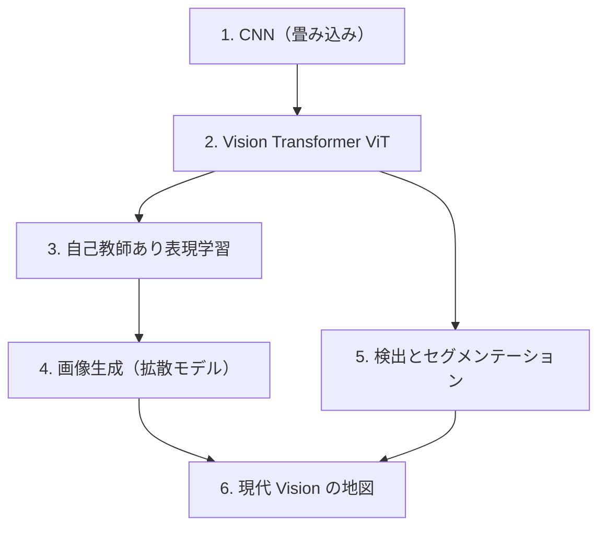

# 視覚（Vision）

**視覚（画像・動画）モダリティ。** ピクセルの2次元/時空間データを理解・生成します。
言語の「トークン列・自己回帰」、音声の「連続⇄離散・拡散/flow matching」と多くの道具を共有します。

:::abstract[このモダリティで身につくこと]
- 画像表現の基礎（畳み込み・ViT のパッチ分割）を説明・実装できる
- 自己教師あり表現学習（対照学習・MAE・DINO）の枠組みを理解する
- 拡散モデルによる画像生成（音声章07の flow matching と地続き）を理解する
- 検出・セグメンテーション・基盤モデル（SAM/CLIP）を地図に位置づけられる
:::

:::tip[他モダリティとの接続]
- 画像生成の **拡散 / flow matching** は [音声の連続生成 TTS](/audio/07-flow-matching-tts/) と同じ数理。
- ViT の **patch = トークン** は [言語のトークン化](/llm/01-language-model-and-tokenization/)、attention は [/llm/02-attention/](/llm/02-attention/) と同じ。
- CLIP・VLM は [マルチモーダル](/multimodal/) への入口。
:::

## ロードマップ

## 章一覧

| # | 章 | 状態 |
| --- | --- | --- |
| 1 | [画像表現の基礎 — 畳み込み (CNN)](/vision/01-cnn/) | ✅ 公開 |
| 2 | [Vision Transformer (ViT)](/vision/02-vit/) | ✅ 公開 |
| 3 | [自己教師あり表現学習](/vision/03-self-supervised/) | ✅ 公開 |
| 4 | [画像生成 — 拡散モデル](/vision/04-diffusion-generation/) | ✅ 公開 |
| 5 | [物体検出とセグメンテーション](/vision/05-detection-segmentation/) | ✅ 公開 |
| 6 | [現代 Vision の地図](/vision/06-vision-landscape/) | ✅ 公開 |

:::note[章は順次追加されます]
「次は◯◯の章を書いて」と指示すると、統一フォーマットで新しい章が追加されます。
:::
