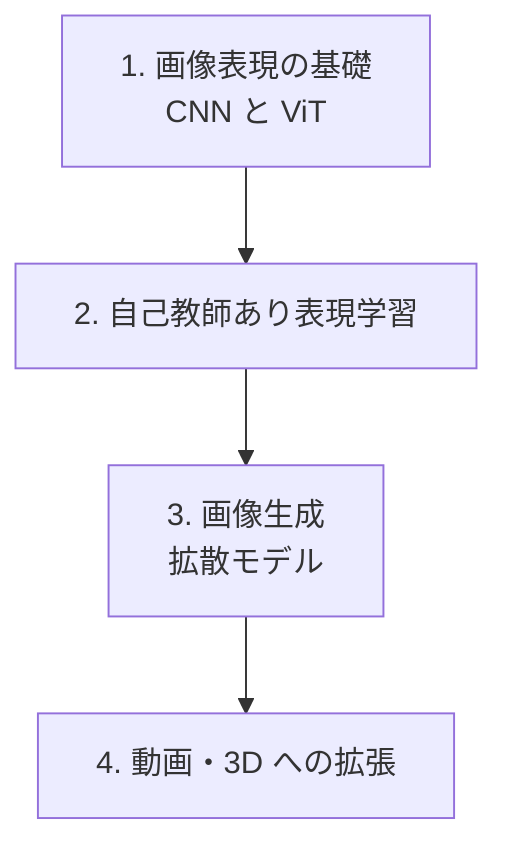

# 視覚（Vision）

**視覚（画像・動画）モダリティ。** ピクセルの2次元/時空間データを理解・生成します。
言語の「トークン列」「自己回帰」、音声の「連続⇄離散」「拡散/flow matching」と多くの道具を共有します。

:::abstract[このモダリティで身につくこと（予定）]
- 画像表現の基礎（畳み込み・ViT のパッチ分割）を説明できる
- 拡散モデルによる画像生成（音声章07の flow matching と地続き）を理解する
- 自己教師あり表現学習（対照学習・MAE）の枠組みを理解する
- 動画・3D への拡張の課題を説明できる
:::

:::tip[他モダリティとの接続]
- 画像生成の **拡散 / flow matching** は [音声の連続生成 TTS](/audio/07-flow-matching-tts/) と同じ数理。
- ViT の **patch = トークン** は [言語のトークン化](/llm/) と同じ発想。
:::

## ロードマップ（予定）

:::note[このモダリティはこれから着手します]
「視覚の◯◯の章を書いて」と指示すると、統一フォーマットで章が追加されます。
:::
