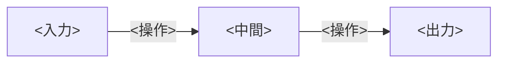

<!--
  章テンプレート（フルセット）。
  新しい章はこのファイルをコピーして docs/<domain>/NN-<slug>.md として作成する。
  - <...> のプレースホルダはすべて埋める。
  - 不要なセクションは「削る」のではなく「短くする」。順序と見出しは統一する。
  - ★ AUTHORING.md §2「説明の深さ基準」を必ず満たす（記号は全定義／構造でなく動作／誤解先回り／
    1ステップ例＋エッジケース／学習時vs推論時／why／対比・アナロジー）。
  - 数式・コード・図(Mermaid/Canvas)・トーンの規約は AUTHORING.md を参照。
  - 完成したら zensical.toml の nav にこの章を 1 行追加し、分野の index.md の章一覧の状態を更新する。
-->

# <章タイトル — 日本語、専門用語は英語のまま>

!!! abstract "学習目標"

    この章を読み終えると、次のことができるようになります。

    - <できるようになること 1（測定可能な動詞で。「説明できる」「導出できる」「実装できる」）>
    - <できるようになること 2>
    - <できるようになること 3>

## 前提知識

- <前提 1。既習章があれば [リンク](../<domain>/NN-<slug>.md) を張る>
- <前提 2>

## 直感

<なぜこれを学ぶのか。どんな問題を解くのか。比喩や具体例で「気持ち」を先に伝える。
数式はまだ出さない。>

## 全体像

<この章で辿る構造を 1 枚で見せる。順方向（分析/前向き）と逆方向（合成/逆問題）を先に一望させる。
Mermaid を第一選択。Mermaid で描けない領域固有の図（波形・分布・信号など）は inline Canvas（AUTHORING.md §7 の制約内）。>



<!-- 既知→未知の橋渡しが効くなら対比表を置く（必須ではない）:
| 既知（例: LLM） | この分野 |
| --- | --- |
| <概念> | <対応物> |
-->

## 理論

<定義・概念・定理を正確に記述する。用語は初出で太字＋英語併記。
★ 記号は全部定義し、静的な構造だけでなく「誰が・いつ・何を入力に・何を出力し・いつ使い回すか」まで書く。
誤解しやすい点（添字の衝突など）は `!!! warning` で名指しして否定する。
定理は `!!! note "定理"` で囲む。>

## 数式の導出

<結果を天下りにしない。前提から結論まで、各ステップに 1 行の説明を添えて導く。
重要な結論は $$ ... $$ の独立行で示し、導出の終わりに $\blacksquare$ を置く。>

## 実装

<理論を確かめる、実行可能なコード（Python 中心）。最小の依存で動くようにする。
コードブロックには title= を付け、**実際に実行した出力**を併記する。>

```python title="<filename>.py"
# <実行可能なコード>
```

```text title="出力"
<実測した出力>
```

## 演習

!!! question "演習 1: <タイトル>"

    <問題文>

    ??? success "解答"

        <解答>

!!! question "演習 2: <タイトル>"

    <問題文>

    ??? success "解答"

        <解答>

## まとめ

!!! success "この章の要点"

    - <要点 1>
    - <要点 2>
    - <要点 3>

### 次に学ぶこと

<この章の次に読むべき章を 1〜2 文で予告し、リンクを張る。>

## 用語ミニ辞典

| 用語 | 一言 |
| --- | --- |
| `<term>` | <一言の定義> |
| `<term>` | <一言の定義> |

## 次のアクション

理論を手で定着させる。**最小の写経 → 動かす → 小実験** を 1 セットで。

1. <写経: 最小のコードを自分で書いて動かす>
2. <動かす: 入出力を 1 つ確認する>
3. <小実験: パラメータを変えて、理論で予想した挙動を目/耳/数値で確かめる>

## 参考文献

1. <著者, タイトル, 出版/会議, 年。原論文・定番教科書・信頼できるオンライン資料。>
2. <...>
