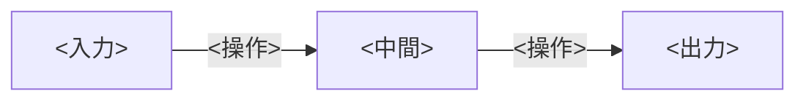

<!--
  章テンプレート（フルセット・Astro）。
  新しい章はこれをコピーして src/pages/<domain>/NN-<slug>.md として作成する。
  - <...> のプレースホルダはすべて埋める。
  - ★ AUTHORING.md §2「説明の深さ基準」を必ず満たす。
  - 完成したら src/lib/nav.mjs に行を追加し、分野 index の章一覧を更新し、`npm run build` で確認する。
  - admonition は ::: ディレクティブ、数式は $/$$（KaTeX）、図は ```mermaid か Canvas（public/figures.js）。
-->

# <章タイトル>

:::abstract[学習目標]
この章を読み終えると、次のことができるようになります。

- <できるようになること 1（測定可能な動詞で）>
- <できるようになること 2>
- <できるようになること 3>
:::

## 前提知識

- <前提 1。既習章があれば [リンク](/<domain>/NN-<slug>/) を張る>
- <前提 2>

## 直感

<なぜこれを学ぶのか。どんな問題を解くのか。比喩や具体例で「気持ち」を先に伝える。数式はまだ出さない。>

## 全体像

<順方向（分析）と逆方向（合成）を 1 枚で一望させる。Mermaid を第一選択。
Mermaid で描けない領域固有の図は Canvas（章には <canvas id="..."> だけ置き、描画は public/figures.js に登録）。>



## 理論

<定義・概念・定理を正確に。記号は全部定義し、静的な構造だけでなく「誰が・いつ・何を入力に・何を出力し・いつ使い回すか」まで書く。
誤解しやすい点（添字の衝突など）は :::warning で名指しして否定する。定理は :::note[定理] で囲む。>

:::warning[よくある誤解]
<「X が出力するのではなく Y が…」のように先回りして否定する>
:::

## 数式の導出

<前提から結論まで、各ステップに 1 行の説明を添えて導く。結論は $$ ... $$ で示し、終わりに $\blacksquare$。>

## 実装

<実行可能なコード（Python 中心）。最小の依存で動くようにし、実測した出力を併記する。>

```python title="<filename>.py"
# <実行可能なコード>
```

```text title="出力"
<実測した出力>
```

## 演習

::::question[演習 1: <タイトル>]
<問題文>

:::details[解答]
<解答>
:::
::::

::::question[演習 2: <タイトル>]
<問題文>

:::details[解答]
<解答>
:::
::::

## まとめ

:::success[この章の要点]
- <要点 1>
- <要点 2>
- <要点 3>
:::

### 次に学ぶこと

<次に読むべき章を 1〜2 文で予告し、[リンク](/<domain>/NN-<slug>/) を張る。>

## 用語ミニ辞典

| 用語 | 一言 |
| --- | --- |
| `<term>` | <一言の定義> |

## 次のアクション

理論を手で定着させる。**最小の写経 → 動かす → 小実験** を 1 セットで。

1. <写経: 最小のコードを自分で書いて動かす>
2. <動かす: 入出力を 1 つ確認する>
3. <小実験: パラメータを変えて、理論で予想した挙動を確かめる>

## 参考文献

1. <著者, タイトル, 出版/会議, 年。原論文・定番教科書・信頼できるオンライン資料。>
