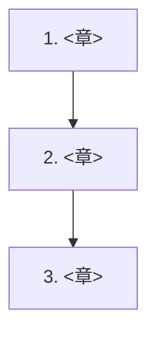

<!--
  分野ランディングページのテンプレート。
  新しい分野は docs/<domain>/index.md としてこのファイルをコピーして作成する。
  作成後、zensical.toml の nav にトップレベルのセクションを 1 つ追加する。
-->

# <分野名（日本語 + 英語）>

<この分野で何を学ぶか、2〜3 文で。>

!!! abstract "この分野で身につくこと"

    - <到達点 1>
    - <到達点 2>
    - <到達点 3>

## 前提知識

- <分野全体の前提 1>
- <分野全体の前提 2>

## ロードマップ

## 章一覧

| # | 章 | 状態 |
| --- | --- | --- |
| 1 | <章タイトル> | 🚧 予定 |
| 2 | <章タイトル> | 🚧 予定 |

!!! note "章は順次追加されます"

    「次は◯◯の章を書いて」と指示すると、統一フォーマットで新しい章が追加されます。
