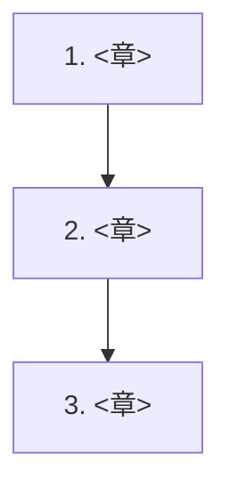

<!--
  分野ランディングのテンプレート（Astro）。src/pages/<domain>/index.md としてコピーして埋める。
  作成後、src/lib/nav.mjs にトップレベルセクションを追加し、トップ src/pages/index.md にカードを 1 枚足す。
-->

# <分野名（日本語 + 英語）>

<この分野で何を学ぶか、2〜3 文で。>

:::abstract[この分野で身につくこと]
- <到達点 1>
- <到達点 2>
- <到達点 3>
:::

## North Star（最終目標）

<学び切った先で「自力でできる/提案できる」状態を 1〜3 個、具体名で。各章はここへ向かう布石。>

1. **<最終目標 1>** — <一言>
2. **<最終目標 2>** — <一言>

## 前提知識

- <分野全体の前提 1>
- <分野全体の前提 2>

## ロードマップ

各ステージは **学ぶ（理論）/ 橋渡し（既知との接続）/ 作る（最小実装）** で進めます。

### 1. <ステージ名> ✅ Ready

- **学ぶ**: <理論・概念>
- **橋渡し**: <既知（例: LLM）との対応・前後章との接続>
- **作る**: <最小の実装課題>

→ [読む](/<domain>/NN-<slug>/)

## 章一覧

| # | 章 | 状態 |
| --- | --- | --- |
| 1 | <章タイトル> | ✅ 公開 |
| 2 | <章タイトル> | 🚧 予定 |

:::note[章は順次追加されます]
「次は◯◯の章を書いて」と指示すると、統一フォーマットで新しい章が追加されます。
:::

<!-- 状態: ✅ 公開/Ready ・ 🛠 執筆中/WIP ・ 🚧 予定/Planned ・ 🎯 最終目標/Capstone -->
